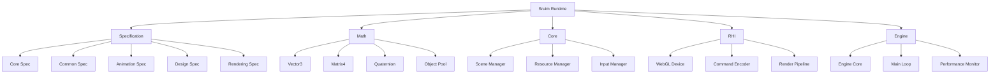
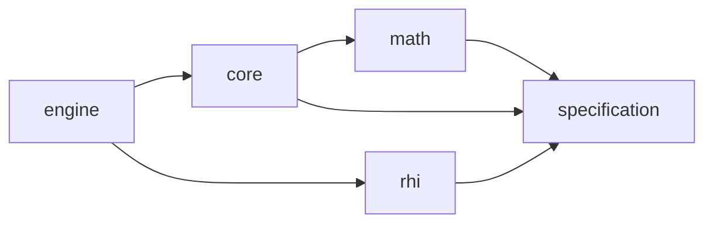

# **Sruim Runtime**

## 高性能模块化WebGL运行时

---

## 📋 目录

1. [项目概述](#项目概述)
2. [技术栈](#技术栈)
3. [安装指南](#安装指南)
4. [使用说明](#使用说明)
5. [项目结构](#项目结构)
6. [API文档](#api文档)
7. [贡献指南](#贡献指南)
8. [故障排除](#故障排除)
9. [更新日志](#更新日志)
10. [许可证信息](#许可证信息)

---

## 📖 项目概述

### 项目名称

**Sruim Runtime** - 一个高性能的模块化WebGL运行时系统，专为现代3D Web应用设计。

### 项目描述

Sruim Runtime是一个基于TypeScript的模块化3D引擎运行时，提供了完整的WebGL抽象层、数学库、场景管理和渲染管线。项目采用monorepo架构，通过pnpm workspaces管理多个相互依赖的包，实现了高度的可扩展性和性能优化。

### 核心功能

- **模块化架构**: 采用monorepo结构，包含specification、math、core、rhi和engine等多个独立包
- **高性能渲染**: 基于WebGL的RHI(Render Hardware Interface)抽象层，支持WebGL 1.0/2.0
- **数学库**: 提供3D向量、矩阵、四元数等数学运算，支持SIMD优化和对象池
- **场景管理**: 完整的场景图系统，支持节点层次结构和组件系统
- **资源管理**: 统一的纹理、着色器、模型等资源加载和管理
- **USD兼容**: 支持OpenUSD格式的3D场景描述和动画数据



---

## 🛠️ 技术栈

### 编程语言

- **TypeScript**: 主要开发语言，提供类型安全和现代JavaScript特性
- **JavaScript**: 运行时环境，支持ES6+特性

### 框架与库

- **WebGL**: 底层图形API，支持1.0和2.0版本
- **WebGL2**: 优先使用的高级图形API，提供更多现代特性
- **OpenUSD**: 3D场景描述标准，用于场景和动画数据交换

### 构建工具

- **pnpm**: 包管理器，支持monorepo工作空间
- **Rollup**: 模块打包工具，用于构建各个包的发布版本
- **TypeScript**: 编译器，将TS代码转换为JS
- **ESLint**: 代码质量检查工具
- **Prettier**: 代码格式化工具
- **Jest**: 单元测试框架

### 开发工具

- **Husky**: Git hooks工具，用于代码提交前检查
- **lint-staged**: 对暂存文件进行lint检查
- **@changesets/cli**: 版本管理和变更日志生成

### 性能优化

- **对象池**: 高性能对象复用机制，减少GC压力
- **SIMD优化**: 利用TypedArray进行向量化计算
- **内存对齐**: 16字节对齐的Float32Array，优化SIMD访问
- **快速算法**: 使用快速反平方根等优化算法

---

## 📦 安装指南

### 环境要求

- **Node.js**: >= 16.0.0
- **pnpm**: >= 7.0.0
- **TypeScript**: >= 4.5.0
- **现代浏览器**: 支持WebGL 1.0/2.0

### 分步安装命令

#### 1. 克隆项目

```bash
git clone https://github.com/your-username/sruim-runtime.git
cd sruim-runtime
```

#### 2. 安装依赖

```bash
# 安装pnpm（如果尚未安装）
npm install -g pnpm

# 安装项目依赖
pnpm install
```

#### 3. 构建项目

```bash
# 构建所有包
pnpm build

# 构建特定包
pnpm build:math
pnpm build:core
pnpm build:rhi
pnpm build:engine
```

#### 4. 运行测试

```bash
# 运行所有测试
pnpm test

# 运行特定包的测试
pnpm test:math
pnpm test:core
```

#### 5. 启动开发服务器

```bash
# 启动RHI演示
pnpm dev:rhi

# 启动其他演示
pnpm dev:engine
```

### 依赖配置

#### 根目录package.json关键配置

```json
{
  "name": "sruim-runtime",
  "private": true,
  "workspaces": [
    "packages/*"
  ],
  "scripts": {
    "build": "pnpm -r run build",
    "build:math": "cd packages/math && pnpm build",
    "build:core": "cd packages/core && pnpm build",
    "build:rhi": "cd packages/rhi && pnpm build",
    "build:engine": "cd packages/engine && pnpm build",
    "test": "pnpm -r run test",
    "dev:rhi": "cd packages/rhi/demo && pnpm dev",
    "lint": "eslint . --ext .ts,.js",
    "format": "prettier --write ."
  },
  "devDependencies": {
    "typescript": "^4.9.0",
    "rollup": "^3.0.0",
    "eslint": "^8.0.0",
    "prettier": "^2.0.0",
    "jest": "^29.0.0",
    "husky": "^8.0.0",
    "lint-staged": "^13.0.0"
  }
}
```

#### 各包的依赖关系



---

## 🚀 使用说明

### 基础操作示例

#### 1. 创建WebGL渲染上下文

```typescript
import { WebGLDevice } from '@maxellabs/rhi';

// 获取画布元素
const canvas = document.getElementById('canvas') as HTMLCanvasElement;

// 创建WebGL设备
const device = new WebGLDevice(canvas, {
  antialias: true,
  alpha: true,
  depth: true,
  stencil: false,
  powerPreference: 'high-performance'
});

// 获取设备信息
const deviceInfo = device.getInfo();
console.log('WebGL版本:', deviceInfo.backend);
console.log('最大纹理尺寸:', deviceInfo.maxTextureSize);
```

#### 2. 使用数学库进行3D计算

```typescript
import { Vector3, Matrix4, Quaternion } from '@maxellabs/math';

// 创建3D向量
const position = Vector3.create(1, 2, 3);
const direction = Vector3.create(0, 0, 1);

// 向量运算
const distance = position.getLength();
const normalized = position.normalized();
const dotProduct = Vector3.dot(position, direction);

// 矩阵变换
const matrix = new Matrix4();
matrix.perspective(45, canvas.width / canvas.height, 0.1, 1000);
matrix.translate(new Vector3(0, 0, -5));
matrix.rotateY(Math.PI / 4);

// 应用矩阵变换到向量
const transformed = Vector3.create(1, 0, 0);
transformed.applyMatrix(matrix);
```

#### 3. 创建和渲染基本几何体

```typescript
import { WebGLDevice, RHIBufferUsage, RHIPrimitiveTopology } from '@maxellabs/rhi';
import { Vector3 } from '@maxellabs/math';

// 创建顶点数据（三角形）
const vertices = new Float32Array([
  // 位置(x, y, z)
  -0.5, -0.5, 0.0,
   0.5, -0.5, 0.0,
   0.0,  0.5, 0.0
]);

// 创建顶点缓冲区
const vertexBuffer = device.createBuffer({
  size: vertices.byteLength,
  usage: RHIBufferUsage.VERTEX,
  hint: 'static',
  initialData: vertices
});

// 创建着色器
const vertexShader = device.createShaderModule({
  code: `
    attribute vec3 aPosition;
    uniform mat4 uModelViewProjection;
    void main() {
      gl_Position = uModelViewProjection * vec4(aPosition, 1.0);
    }
  `,
  language: 'glsl',
  stage: 'vertex'
});

const fragmentShader = device.createShaderModule({
  code: `
    precision mediump float;
    void main() {
      gl_FragColor = vec4(1.0, 0.0, 0.0, 1.0);
    }
  `,
  language: 'glsl',
  stage: 'fragment'
});

// 创建渲染管线
const pipeline = device.createRenderPipeline({
  vertexShader,
  fragmentShader,
  primitiveTopology: RHIPrimitiveTopology.TRIANGLE_LIST,
  vertexLayout: {
    buffers: [{
      stride: 12, // 3个float * 4字节
      attributes: [{
        name: 'aPosition',
        format: 'float32x3',
        offset: 0,
        shaderLocation: 0
      }]
    }]
  }
});

// 渲染循环
function render() {
  const commandEncoder = device.createCommandEncoder();
  const renderPass = commandEncoder.beginRenderPass({
    colorAttachments: [{
      view: canvas.getContext('webgl')!.getParameter(canvas.getContext('webgl')!.FRAMEBUFFER),
      loadOp: 'clear',
      storeOp: 'store',
      clearColor: [0.1, 0.1, 0.1, 1.0]
    }]
  });
  
  renderPass.setPipeline(pipeline);
  renderPass.setVertexBuffer(0, vertexBuffer);
  renderPass.draw(3, 1, 0, 0);
  renderPass.end();
  
  device.submit([commandEncoder.finish()]);
  requestAnimationFrame(render);
}

render();
```

### 核心功能演示

#### 1. 使用对象池优化性能

```typescript
import { Vector3 } from '@maxellabs/math';

// 启用对象池
import { MathConfig } from '@maxellabs/math/config/mathConfig';
MathConfig.setObjectPoolEnabled(true);

// 预分配对象池
Vector3.preallocate(1000);

// 使用对象池创建向量
function processVectors() {
  const vectors: Vector3[] = [];
  
  for (let i = 0; i < 1000; i++) {
    // 从对象池创建向量
    const vec = Vector3.create(
      Math.random() * 2 - 1,
      Math.random() * 2 - 1,
      Math.random() * 2 - 1
    );
    
    // 处理向量
    vec.normalize();
    vec.scale(2.0);
    
    vectors.push(vec);
  }
  
  // 使用完成后释放回对象池
  vectors.forEach(vec => Vector3.release(vec));
  
  // 获取对象池统计信息
  const stats = Vector3.getPoolStats();
  console.log('对象池统计:', stats);
}

processVectors();
```

#### 2. 创建完整的3D场景

```typescript
import { Engine } from '@maxellabs/engine';
import { WebGLDevice } from '@maxellabs/rhi';
import { Vector3, Matrix4 } from '@maxellabs/math';

// 创建引擎实例
const engine = new Engine({
  canvas: 'canvas',
  targetFrameRate: 60,
  enableVSync: true,
  antialias: true,
  debug: true
});

// 初始化引擎
await engine.initialize();

// 获取场景管理器
const sceneManager = engine.getSceneManager();

// 创建场景
const scene = sceneManager.createScene('main-scene');

// 创建相机节点
const cameraNode = scene.createNode('camera');
cameraNode.position = new Vector3(0, 0, 5);
cameraNode.lookAt(new Vector3(0, 0, 0));

// 创建立方体节点
const cubeNode = scene.createNode('cube');
cubeNode.position = new Vector3(0, 0, 0);

// 添加旋转动画
cubeNode.addComponent({
  name: 'rotation',
  update: (deltaTime: number) => {
    cubeNode.rotation.y += deltaTime * 0.5;
    cubeNode.rotation.x += deltaTime * 0.3;
  }
});

// 启动引擎
engine.start();

// 监听引擎事件
engine.addEventListener('update', (event) => {
  const { deltaTime } = event;
  
  // 获取性能统计
  const stats = engine.getPerformanceStats();
  console.log('FPS:', engine.getFrameRate());
  console.log('平均帧时间:', stats.averageFrameTime + 'ms');
});

// 处理窗口大小变化
window.addEventListener('resize', () => {
  const canvas = document.getElementById('canvas') as HTMLCanvasElement;
  canvas.width = window.innerWidth;
  canvas.height = window.innerHeight;
  
  // 更新相机投影矩阵
  const aspect = canvas.width / canvas.height;
  cameraNode.camera.setProjectionMatrix(Matrix4.perspective(45, aspect, 0.1, 1000));
});
```

### 常见场景代码片段

#### 1. 纹理映射和材质

```typescript
import { WebGLDevice, RHITextureFormat, RHITextureUsage } from '@maxellabs/rhi';

// 创建纹理
const texture = device.createTexture({
  width: 512,
  height: 512,
  format: RHITextureFormat.RGBA8_UNORM,
  usage: RHITextureUsage.SAMPLED | RHITextureUsage.COPY_DST,
  dimension: '2d'
});

// 加载图像数据
const image = new Image();
image.src = 'texture.jpg';
image.onload = () => {
  // 创建画布来获取图像数据
  const canvas = document.createElement('canvas');
  canvas.width = image.width;
  canvas.height = image.height;
  const ctx = canvas.getContext('2d')!;
  ctx.drawImage(image, 0, 0);
  
  const imageData = ctx.getImageData(0, 0, image.width, image.height);
  texture.update(imageData.data);
};

// 创建采样器
const sampler = device.createSampler({
  magFilter: 'linear',
  minFilter: 'linear',
  mipmapFilter: 'linear',
  addressModeU: 'repeat',
  addressModeV: 'repeat'
});

// 在着色器中使用纹理
const fragmentShader = device.createShaderModule({
  code: `
    precision mediump float;
    uniform sampler2D uTexture;
    varying vec2 vTexCoord;
    void main() {
      gl_FragColor = texture2D(uTexture, vTexCoord);
    }
  `,
  language: 'glsl',
  stage: 'fragment'
});
```

#### 2. 光照和阴影

```typescript
// 创建光源节点
const lightNode = scene.createNode('directional-light');
lightNode.position = new Vector3(5, 5, 5);
lightNode.lookAt(new Vector3(0, 0, 0));

// 添加光源组件
lightNode.addComponent({
  name: 'directional-light',
  color: new Vector3(1, 1, 1),
  intensity: 1.0,
  castShadow: true,
  shadowMapSize: 1024,
  shadowBias: 0.001,
  shadowRadius: 2.0
});

// 创建阴影接收平面
const planeNode = scene.createNode('ground-plane');
planeNode.position = new Vector3(0, -2, 0);
planeNode.scale = new Vector3(10, 1, 10);

// 添加阴影接收材质
planeNode.addComponent({
  name: 'shadow-receiver',
  receiveShadow: true,
  material: {
    type: 'standard',
    color: new Vector3(0.8, 0.8, 0.8),
    roughness: 0.8,
    metalness: 0.2
  }
});

// 在着色器中计算光照
const lightingShader = device.createShaderModule({
  code: `
    precision mediump float;
    uniform vec3 uLightDirection;
    uniform vec3 uLightColor;
    uniform float uLightIntensity;
    varying vec3 vNormal;
    varying vec3 vPosition;
    
    void main() {
      vec3 normal = normalize(vNormal);
      vec3 lightDir = normalize(-uLightDirection);
      
      // 漫反射光照
      float diff = max(dot(normal, lightDir), 0.0);
      vec3 diffuse = diff * uLightColor * uLightIntensity;
      
      // 环境光
      vec3 ambient = vec3(0.1, 0.1, 0.1);
      
      gl_FragColor = vec4(ambient + diffuse, 1.0);
    }
  `,
  language: 'glsl',
  stage: 'fragment'
});
```

#### 3. 动画和插值

```typescript
import { Vector3, Quaternion } from '@maxellabs/math';

// 创建动画关键帧
interface KeyFrame {
  time: number;
  position: Vector3;
  rotation: Quaternion;
  scale: Vector3;
}

const keyFrames: KeyFrame[] = [
  {
    time: 0,
    position: Vector3.create(-5, 0, 0),
    rotation: Quaternion.identity(),
    scale: Vector3.create(1, 1, 1)
  },
  {
    time: 1,
    position: Vector3.create(0, 2, 0),
    rotation: Quaternion.fromAxisAngle(Vector3.Y, Math.PI / 2),
    scale: Vector3.create(1.5, 1.5, 1.5)
  },
  {
    time: 2,
    position: Vector3.create(5, 0, 0),
    rotation: Quaternion.fromAxisAngle(Vector3.Y, Math.PI),
    scale: Vector3.create(1, 1, 1)
  }
];

// 创建动画组件
const animationComponent = {
  name: 'keyframe-animation',
  keyFrames: keyFrames,
  currentTime: 0,
  duration: 2,
  loop: true,
  
  update: (deltaTime: number) => {
    this.currentTime += deltaTime;
    
    if (this.loop && this.currentTime > this.duration) {
      this.currentTime = this.currentTime % this.duration;
    }
    
    // 找到当前时间前后的关键帧
    let prevFrame = this.keyFrames[0];
    let nextFrame = this.keyFrames[this.keyFrames.length - 1];
    
    for (let i = 0; i < this.keyFrames.length - 1; i++) {
      if (this.currentTime >= this.keyFrames[i].time && 
          this.currentTime <= this.keyFrames[i + 1].time) {
        prevFrame = this.keyFrames[i];
        nextFrame = this.keyFrames[i + 1];
        break;
      }
    }
    
    // 计算插值因子
    const frameDuration = nextFrame.time - prevFrame.time;
    const t = frameDuration > 0 ? (this.currentTime - prevFrame.time) / frameDuration : 0;
    
    // 插值位置
    const position = Vector3.lerp(
      prevFrame.position,
      nextFrame.position,
      t
    );
    
    // 球面线性插值旋转
    const rotation = Quaternion.slerp(
      prevFrame.rotation,
      nextFrame.rotation,
      t
    );
    
    // 插值缩放
    const scale = Vector3.lerp(
      prevFrame.scale,
      nextFrame.scale,
      t
    );
    
    // 应用到节点
    cubeNode.position = position;
    cubeNode.rotation = rotation;
    cubeNode.scale = scale;
  }
};

// 添加动画组件到节点
cubeNode.addComponent(animationComponent);
```

---

## 📁 项目结构

### 目录树说明

```
sruim-runtime/
├── packages/                    # 包目录
│   ├── specification/          # 规范定义包
│   │   ├── src/
│   │   │   ├── common/         # 通用规范
│   │   │   │   ├── rhi/        # RHI接口规范
│   │   │   │   │   ├── resources/     # 资源规范
│   │   │   │   │   ├── types/         # 类型定义
│   │   │   │   │   └── descriptors.ts # 描述符
│   │   │   │   └── animation/  # 动画规范
│   │   │   ├── core/          # 核心规范
│   │   │   ├── animation/     # 动画规范
│   │   │   ├── design/        # 设计规范
│   │   │   ├── package/       # 包规范
│   │   │   ├── rendering/     # 渲染规范
│   │   │   └── workflow/      # 工作流规范
│   │   └── package.json
│   │
│   ├── math/                   # 数学库包
│   │   ├── src/
│   │   │   ├── core/          # 核心数学类
│   │   │   │   ├── vector3.ts  # 3D向量实现
│   │   │   │   ├── matrix4.ts  # 4x4矩阵实现
│   │   │   │   ├── quaternion.ts # 四元数实现
│   │   │   │   └── utils.ts    # 数学工具函数
│   │   │   ├── extensions/    # 扩展数学功能
│   │   │   ├── config/        # 配置文件
│   │   │   │   └── mathConfig.ts # 数学库配置
│   │   │   └── pool/          # 对象池实现
│   │   │       └── objectPool.ts # 对象池类
│   │   └── package.json
│   │
│   ├── core/                   # 核心包
│   │   ├── src/
│   │   │   ├── base/          # 基础类
│   │   │   │   ├── event-dispatcher.ts # 事件分发器
│   │   │   │   ├── IOC.ts     # 依赖注入容器
│   │   │   │   └── time.ts    # 时间管理
│   │   │   ├── scene/         # 场景管理
│   │   │   │   ├── scene.ts   # 场景类
│   │   │   │   └── scene-manager.ts # 场景管理器
│   │   │   ├── resource/      # 资源管理
│   │   │   │   └── resource-manager.ts # 资源管理器
│   │   │   ├── input/         # 输入管理
│   │   │   │   └── input-manager.ts # 输入管理器
│   │   │   ├── shader/        # 着色器系统
│   │   │   │   └── shader.ts  # 着色器类
│   │   │   └── engine.ts      # 引擎核心类
│   │   └── package.json
│   │
│   ├── rhi/                    # 渲染硬件接口包
│   │   ├── src/
│   │   │   └── webgl/         # WebGL实现
│   │   │       ├── GLDevice.ts # WebGL设备类
│   │   │       ├── commands/  # 命令系统
│   │   │       │   ├── GLCommandEncoder.ts # 命令编码器
│   │   │       │   ├── GLCommandBuffer.ts # 命令缓冲区
│   │   │       │   └── GLRenderPass.ts # 渲染通道
│   │   │       ├── resources/ # 资源实现
│   │   │       │   ├── GLBuffer.ts # 缓冲区
│   │   │       │   ├── GLTexture.ts # 纹理
│   │   │       │   ├── GLSampler.ts # 采样器
│   │   │       │   └── GLShader.ts # 着色器
│   │   │       ├── bindings/  # 绑定系统
│   │   │       │   ├── GLBindGroupLayout.ts # 绑定组布局
│   │   │       │   └── GLBindGroup.ts # 绑定组
│   │   │       ├── pipeline/  # 管线系统
│   │   │       │   ├── GLPipelineLayout.ts # 管线布局
│   │   │       │   ├── GLRenderPipeline.ts # 渲染管线
│   │   │       │   └── GLComputePipeline.ts # 计算管线
│   │   │       └── utils/     # 工具函数
│   │   │           └── GLUtils.ts # WebGL工具
│   │   ├── demo/              # 演示代码
│   │   │   └── src/
│   │   │       └── basic.ts   # 基础演示
│   │   └── package.json
│   │
│   └── engine/                 # 引擎包
│       ├── src/
│       │   └── index.ts       # 引擎入口
│       └── package.json
│
├── .github/                    # GitHub配置
│   └── workflows/              # GitHub Actions
│       └── ci.yml             # 持续集成配置
│
├── docs/                       # 文档目录
│   ├── api/                    # API文档
│   ├── guides/                 # 使用指南
│   └── examples/               # 示例代码
│
├── scripts/                    # 构建脚本
│   ├── build.js               # 构建脚本
│   ├── release.js             # 发布脚本
│   └── test.js                # 测试脚本
│
├── .eslintrc.json             # ESLint配置
├── .gitignore                 # Git忽略文件
├── .prettierrc.json           # Prettier配置
├── CHANGELOG.md               # 更新日志
├── package.json               # 根包配置
├── pnpm-workspace.yaml        # pnpm工作空间配置
└── README.md                  # 项目说明文档
```

### 关键文件作用

#### 根目录文件

- **package.json**: 定义项目依赖、脚本和元数据
- **pnpm-workspace.yaml**: 配置pnpm工作空间，管理monorepo结构
- **CHANGELOG.md**: 记录版本变更历史
- **.eslintrc.json**: ESLint配置文件，定义代码规范
- **.prettierrc.json**: Prettier配置文件，定义代码格式化规则

#### 核心包文件

