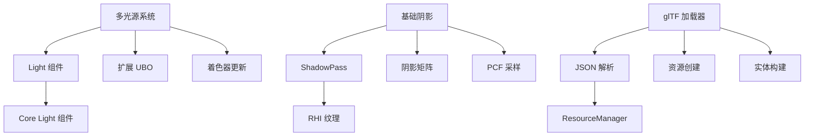

# Engine 包短期路线图 (1-2周)

## 目标概述

### 短期目标 (1-2周)
- **多光源系统**: 支持多个方向光、点光源、聚光灯
- **基础阴影**: 实现阴影贴图渲染
- **glTF 加载器**: 支持 glTF 2.0 模型加载

### 中期目标 (1个月)
- **完整 PBR 管线**: 纹理采样、环境光照
- **后处理框架**: Bloom、Tone Mapping
- **HDR 渲染**: 高动态范围渲染管线

---

## 1. 多光源系统

### 1.1 设计目标
- 支持 4+ 个光源 (方向光 + 点光源 + 聚光灯)
- 基于 std140 UBO 的高效数据传递
- 与现有 PBR 材质无缝集成

### 1.2 组件扩展

#### Light 组件
```typescript
interface LightData {
  type: 'directional' | 'point' | 'spot';
  color: [number, number, number];
  intensity: number;
  range?: number;        // 点光源/聚光灯
  innerAngle?: number;   // 聚光灯
  outerAngle?: number;   // 聚光灯
}

class Light extends Component implements LightData {
  type: 'directional' | 'point' | 'spot';
  color: [number, number, number] = [1, 1, 1];
  intensity: number = 1;
  range?: number;
  innerAngle?: number;
  outerAngle?: number;
}
```

#### 扩展 UBO 布局
```glsl
layout(std140) uniform Lights {
  vec4 lightColors[4];      // RGB + intensity
  vec4 lightPositions[4];   // XYZ + type (0=dir, 1=point, 2=spot)
  vec4 lightDirections[4];  // XYZ + range
  vec4 lightParams[4];      // innerAngle, outerAngle, padding, padding
  uint lightCount;
};
```

### 1.3 实现步骤
1. **添加 Light 组件**: 扩展 Core 的 Light 组件
2. **扩展 UBO**: 增加 Lights UBO 到渲染器
3. **更新着色器**: 支持多光源 PBR 计算
4. **集成查询**: 在渲染循环中收集光源数据

---

## 2. 基础阴影系统

### 2.1 设计目标
- 方向光阴影贴图 (Shadow Map)
- 基础 PCF 软阴影
- CSM (Cascaded Shadow Maps) 支持

### 2.2 ShadowPass 架构

#### ShadowPass 类
```typescript
class ShadowPass {
  private shadowMap: IRHITexture;
  private shadowPipeline: IRHIRenderPipeline;
  private shadowUBO: IRHIBuffer;

  constructor(device: IRHIDevice, mapSize: number = 1024) {
    // 创建阴影贴图
    this.shadowMap = device.createTexture({
      width: mapSize,
      height: mapSize,
      format: 'depth32float',
      usage: 'render-attachment | sampled'
    });

    // 创建阴影渲染管线
    // ...
  }

  renderShadowMap(scene: Scene, light: DirectionalLight): void {
    // 从光源视角渲染场景深度
    // ...
  }
}
```

#### 阴影矩阵计算
```typescript
function createLightViewProjection(light: DirectionalLight, sceneBounds: Box3): Float32Array {
  // 计算光源视图矩阵
  const lightView = createLookAt(light.position, [0,0,0], [0,1,0]);

  // 计算正交投影矩阵 (基于场景包围盒)
  const lightProj = createOrthographic(-size, size, -size, size, near, far);

  // 返回光源空间变换矩阵
  return multiplyMatrices(lightProj, lightView);
}
```

### 2.3 实现步骤
1. **创建 ShadowPass**: 阴影渲染通道
2. **扩展渲染器**: 集成阴影贴图生成
3. **更新着色器**: 添加阴影采样
4. **PCF 实现**: 基础软阴影

---

## 3. glTF 加载器

### 3.1 设计目标
- 支持 glTF 2.0 规范
- 纹理、材质、动画支持
- Draco 几何压缩
- KTX2 纹理压缩

### 3.2 GLTFLoader 架构

#### 核心接口
```typescript
interface GLTFResult {
  scene: Entity;                    // 根场景节点
  meshes: Map<string, MeshData>;    // 网格数据
  materials: Map<string, Material>; // 材质
  textures: Map<string, Texture>;   // 纹理
  animations: Animation[];          // 动画数据
}

class GLTFLoader implements IResourceLoader<GLTFResult> {
  constructor(private resourceManager: ResourceManager) {}

  async load(url: string): Promise<GLTFResult> {
    // 1. 加载 glTF JSON
    const gltf = await this.loadGLTF(url);

    // 2. 解析并创建资源
    const result = await this.parseGLTF(gltf);

    // 3. 创建实体层级
    return this.createEntities(result);
  }
}
```

### 3.3 实现步骤
1. **基础加载器**: JSON 解析和二进制数据处理
2. **网格创建**: 从 accessor 创建 GPU 缓冲区
3. **材质转换**: glTF PBR 到 Engine PBR
4. **纹理加载**: 支持多种图像格式
5. **场景构建**: 创建实体层级结构

---

## 4. 实施计划

### Phase 1: 多光源系统 (3-4天)
1. 扩展 Light 组件支持多种光源类型
2. 更新渲染器 UBO 布局
3. 修改着色器支持多光源计算
4. 更新 Demo 添加多个光源

### Phase 2: 基础阴影 (3-4天)
1. 实现 ShadowPass 类
2. 添加阴影贴图生成逻辑
3. 更新主渲染器集成阴影
4. 实现基础 PCF 软阴影

### Phase 3: glTF 加载器 (3-4天)
1. 实现基础 glTF JSON 解析
2. 添加网格和材质创建
3. 支持纹理加载
4. 创建实体层级结构

---

## 5. 依赖关系



---

## 6. 验证标准

### 多光源系统
- [ ] 支持 4 个方向光同时渲染
- [ ] 点光源衰减正确
- [ ] 聚光灯锥形衰减正确

### 基础阴影
- [ ] 方向光产生阴影
- [ ] 阴影边缘平滑 (PCF)
- [ ] 阴影正确投影到接收面上

### glTF 加载器
- [ ] 加载基础 glTF 模型
- [ ] 材质和纹理正确应用
- [ ] 模型层次结构正确
- [ ] 动画数据解析 (可选)

---

## 7. 风险与注意事项

### 性能考虑
- 多光源可能影响渲染性能
- 阴影贴图分辨率与质量平衡
- glTF 加载可能阻塞主线程

### 兼容性
- WebGL 2.0 扩展支持
- 移动设备性能限制
- 浏览器纹理大小限制

### 架构约束
- 保持与 Core 包的解耦
- 遵循 RHI 抽象层设计
- 保持 ECS 组件模式