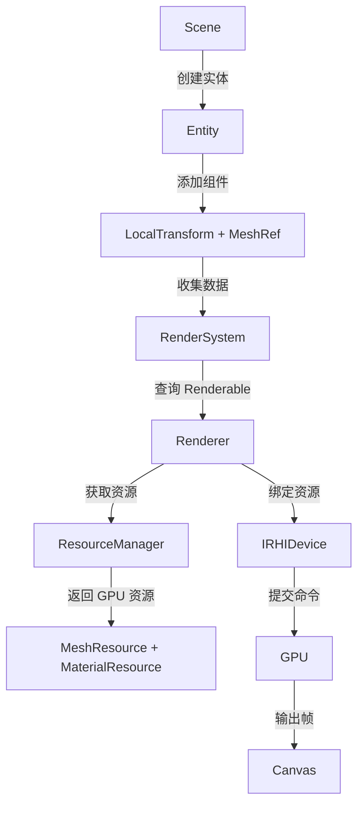
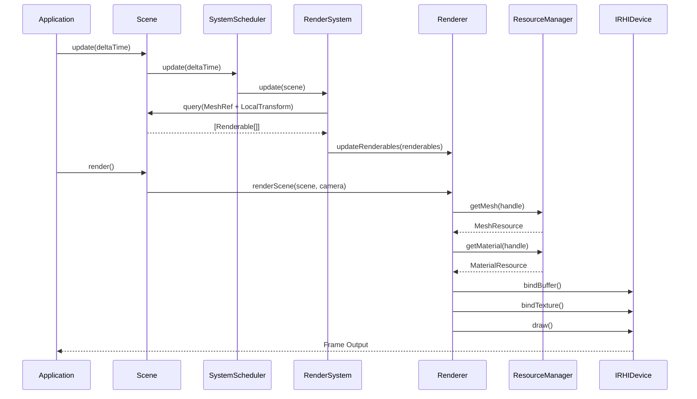
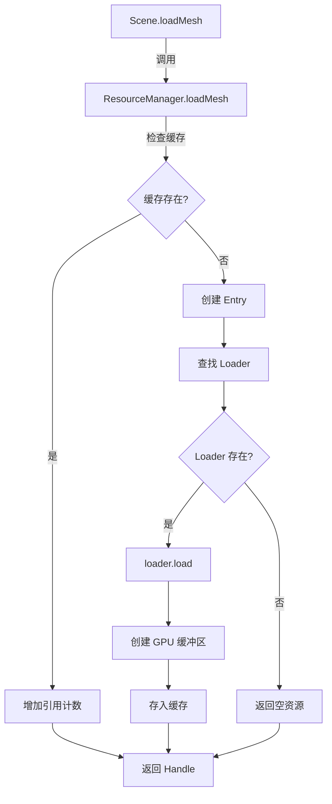

## 执行摘要 (Executive Summary)

**当前状态**: 架构完整度 85%，核心模块已就绪，缺失着色器编译框架和 Demo。
**关键指标**: ECS(100%)、RHI(100%)、Scene(100%)、Renderer(100%)、资源加载器(50%)。
**实施路径**: Phase 1 快速 Demo(2-3h) → Phase 2 着色器编译(3-4h) → Phase 3 资源加载器(2-3h)。

---

## 1. 当前架构状态 (Current Architecture Status)

### 已完成模块表格

| 模块名称          | 文件路径                                    | 代码行数 | 状态    | 完成度 |
|:-----------------|:-------------------------------------------|:--------|:--------|:------|
| **ECS Core**     | `packages/core/src/ecs/`                   | ~3500   | ✅ 完成  | 100%  |
| **RHI Abstraction** | `packages/specification/src/common/rhi.ts` | ~800    | ✅ 完成  | 100%  |
| **Scene Management** | `packages/core/src/scene/scene.ts`        | ~600    | ✅ 完成  | 100%  |
| **Renderer Base** | `packages/core/src/renderer/renderer.ts`   | ~456    | ✅ 完成  | 100%  |
| **RenderSystem** | `packages/core/src/systems/render-system.ts` | ~200  | ✅ 完成  | 100%  |
| **Resource Manager** | `packages/core/src/resources/resource-manager.ts` | ~514 | ✅ 完成 | 100% |
| **Component System** | `packages/core/src/components/`          | ~2000   | ✅ 完成  | 100%  |
| **Resource Loaders** | `packages/core/src/resources/loaders/`    | ~400    | ⚠️ 框架 | 50%   |
| **Shader Compiler** | ❌ 不存在                                  | 0       | ❌ 缺失  | 0%    |
| **Core Demo**    | ❌ 不存在                                  | 0       | ❌ 缺失  | 0%    |

**架构完整度**: 85% (8/10 模块已完成，其中 6 个 100%，1 个 50%，2 个 0%)

---

## 2. 差距分析 (Gap Analysis)

### Gap 1: Shader Compilation Framework

#### 当前状态
- ❌ **不存在**: 无 Shader 编译器模块
- ❌ **不存在**: 无 Shader 缓存机制
- ❌ **不存在**: 无 Shader 类型接口
- ⚠️ **部分存在**: `IMaterialResource` 包含 `shaderId` 字段，但无实际编译逻辑

#### 需要的接口

```typescript
/**
 * 着色器数据结构
 * @remarks 从 @maxellabs/specification 导出
 */
export interface IShaderSource {
  /** 顶点着色器代码 */
  vertex: string;
  /** 片段着色器代码 */
  fragment: string;
  /** 属性定义 */
  attributes?: Record<string, ShaderAttributeType>;
  /** Uniform 定义 */
  uniforms?: Record<string, ShaderUniformType>;
}

/**
 * 编译后的着色器程序
 * @remarks 从 @maxellabs/specification 导出
 */
export interface IShaderProgram {
  /** 程序 ID */
  id: string;
  /** Uniform 位置缓存 */
  uniformLocations: Map<string, WebGLUniformLocation>;
  /** Attribute 位置缓存 */
  attributeLocations: Map<string, number>;
}

/**
 * 着色器编译器接口
 * @remarks Core 包实现
 */
export interface IShaderCompiler {
  compile(source: IShaderSource): IShaderProgram;
  getProgram(id: string): IShaderProgram | undefined;
  dispose(id: string): void;
  disposeAll(): void;
}
```

#### 实现步骤

```pseudocode
FUNCTION ShaderCompiler.compile(source: IShaderSource) -> IShaderProgram:
  1. 验证源代码非空
  2. 编译顶点着色器:
     ├─ device.createShader('vertex')
     ├─ device.shaderSource(shader, source.vertex)
     └─ device.compileShader(shader)
  3. 编译片段着色器:
     ├─ device.createShader('fragment')
     ├─ device.shaderSource(shader, source.fragment)
     └─ device.compileShader(shader)
  4. 链接程序:
     ├─ device.createProgram()
     ├─ device.attachShader(program, vertexShader)
     ├─ device.attachShader(program, fragmentShader)
     └─ device.linkProgram(program)
  5. 缓存 Uniform/Attribute 位置:
     ├─ FOR EACH uniform IN source.uniforms:
     │   └─ cache[uniform] = device.getUniformLocation(program, uniform)
     └─ FOR EACH attribute IN source.attributes:
         └─ cache[attribute] = device.getAttribLocation(program, attribute)
  6. 返回 IShaderProgram

FUNCTION ShaderCompiler.getProgram(id: string) -> IShaderProgram | undefined:
  RETURN programCache.get(id)

FUNCTION ShaderCompiler.dispose(id: string):
  program = programCache.get(id)
  IF program EXISTS:
    device.deleteProgram(program)
    programCache.delete(id)

FUNCTION ShaderCompiler.disposeAll():
  FOR EACH program IN programCache:
    device.deleteProgram(program)
  programCache.clear()
```

#### 宪法约束
- 🚫 **NO WebGL 依赖**: 必须使用 `IRHIDevice` 接口，不直接调用 WebGL API
- ✅ **类型来源**: 所有类型必须从 `@maxellabs/specification` 导入
- ✅ **错误处理**: 编译失败必须抛出有意义的错误信息

---

### Gap 2: Core Triangle Demo

#### 当前状态
- ❌ **不存在**: 无任何 Demo 文件
- ❌ **不存在**: 无示例着色器代码
- ❌ **不存在**: 无最小化渲染流程

#### 文件结构

```
packages/core/examples/
├── triangle/
│   ├── index.ts              # 主入口（创建场景、实体、渲染循环）
│   ├── triangle-renderer.ts  # 继承 Renderer（实现 render() 方法）
│   ├── shaders.ts            # 着色器代码（简单的 vertex + fragment）
│   └── README.md             # 运行说明
└── package.json              # 示例依赖（需要 @maxellabs/rhi）
```

#### 代码大纲

```typescript
// === triangle/index.ts ===
import { Scene, LocalTransform, MeshRef } from '@maxellabs/core';
import { WebGLDevice } from '@maxellabs/rhi';
import { TriangleRenderer } from './triangle-renderer';

// 1. 创建 RHI 设备
const canvas = document.createElement('canvas');
const device = new WebGLDevice(canvas);

// 2. 创建场景
const scene = new Scene({ device, name: 'TriangleDemo' });

// 3. 创建三角形实体
const triangle = scene.createEntity('Triangle');
scene.world.addComponent(
  triangle,
  LocalTransform,
  LocalTransform.fromData({
    position: { x: 0, y: 0, z: -5 },
    rotation: { x: 0, y: 0, z: 0, w: 1 },
    scale: { x: 1, y: 1, z: 1 },
  })
);
scene.world.addComponent(
  triangle,
  MeshRef,
  MeshRef.fromData({ assetId: 'triangle' })
);

// 4. 创建渲染器
const renderer = new TriangleRenderer({ device });
scene.setRenderer(renderer);

// 5. 渲染循环
function loop(time: number) {
  const dt = time - lastTime;
  scene.update(dt / 1000);
  renderer.beginFrame();
  scene.render();
  renderer.endFrame();
  requestAnimationFrame(loop);
}
requestAnimationFrame(loop);

// === triangle/triangle-renderer.ts ===
import { Renderer, RenderContext } from '@maxellabs/core';
import { vertexShader, fragmentShader } from './shaders';

export class TriangleRenderer extends Renderer {
  private shaderProgram!: IShaderProgram;
  private vertexBuffer!: IRHIBuffer;

  constructor(config: RendererConfig) {
    super(config);
    this.initShaders();
    this.initTriangleMesh();
  }

  private initShaders(): void {
    // 编译着色器（Gap 1 解决后）
    this.shaderProgram = this.device.compileShader({
      vertex: vertexShader,
      fragment: fragmentShader,
    });
  }

  private initTriangleMesh(): void {
    // 硬编码三角形顶点
    const vertices = new Float32Array([
      // x,    y,   z,    r,   g,   b
      0.0,  0.5, 0.0,  1.0, 0.0, 0.0, // 顶部 (红色)
      -0.5, -0.5, 0.0,  0.0, 1.0, 0.0, // 左下 (绿色)
      0.5, -0.5, 0.0,  0.0, 0.0, 1.0, // 右下 (蓝色)
    ]);

    this.vertexBuffer = this.device.createBuffer({
      usage: 'vertex',
      data: vertices,
    });
  }

  protected override render(ctx: RenderContext): void {
    // 1. 使用着色器程序
    this.device.useProgram(this.shaderProgram);

    // 2. 绑定顶点缓冲区
    this.device.bindBuffer('vertex', this.vertexBuffer);

    // 3. 设置顶点属性
    this.device.enableVertexAttribArray(0); // position
    this.device.vertexAttribPointer(0, 3, 'float', false, 24, 0);
    this.device.enableVertexAttribArray(1); // color
    this.device.vertexAttribPointer(1, 3, 'float', false, 24, 12);

    // 4. 绘制
    this.device.drawArrays('triangles', 0, 3);
  }

  dispose(): void {
    super.dispose();
    this.vertexBuffer?.destroy();
    // 释放着色器程序（Gap 1 解决后）
  }
}

// === triangle/shaders.ts ===
export const vertexShader = `
  attribute vec3 a_position;
  attribute vec3 a_color;
  varying vec3 v_color;

  void main() {
    gl_Position = vec4(a_position, 1.0);
    v_color = a_color;
  }
`;

export const fragmentShader = `
  precision mediump float;
  varying vec3 v_color;

  void main() {
    gl_FragColor = vec4(v_color, 1.0);
  }
`;
```

#### 渲染流程伪代码

```pseudocode
FUNCTION main():
  1. 初始化:
     ├─ canvas = createCanvas(800, 600)
     ├─ device = new WebGLDevice(canvas)
     ├─ scene = new Scene({ device })
     └─ renderer = new TriangleRenderer({ device })

  2. 构建场景:
     ├─ triangle = scene.createEntity('Triangle')
     ├─ scene.world.addComponent(triangle, LocalTransform, ...)
     └─ scene.world.addComponent(triangle, MeshRef, ...)

  3. 渲染循环:
     FUNCTION loop(time):
       ├─ deltaTime = time - lastTime
       ├─ scene.update(deltaTime)
       ├─ renderer.beginFrame()
       ├─ scene.render()
       ├─ renderer.endFrame()
       └─ requestAnimationFrame(loop)
```

#### 宪法约束
- 🚫 **NO WebGL 依赖**: Demo 不直接调用 WebGL API，必须通过 `IRHIDevice`
- ✅ **类型安全**: 使用 TypeScript 严格模式
- ✅ **最小化**: 仅渲染一个三角形，无复杂逻辑

---

### Gap 3: Resource Loader Implementation

#### 当前状态
- ✅ **已完成**: Loader 接口 (`IResourceLoader<T>`)
- ✅ **已完成**: 默认 Loader (返回空资源)
- ❌ **缺失**: 实际文件加载逻辑（GLTF、PNG、JSON）
- ❌ **缺失**: 资源格式定义（Mesh 顶点布局、Material Schema）

#### Mesh 格式定义

```typescript
/**
 * 网格数据格式（用于加载器）
 * @remarks 从 @maxellabs/specification 导出
 */
export interface IMeshData {
  /** 顶点数据（交错布局） */
  vertices: Float32Array;
  /** 索引数据 */
  indices?: Uint16Array | Uint32Array;
  /** 顶点布局 */
  layout: VertexAttribute[];
  /** 绘制模式 */
  primitiveType: 'triangles' | 'lines' | 'points';
}

export interface VertexAttribute {
  /** 属性名 */
  name: string;
  /** 数据类型 */
  type: 'float' | 'uint8' | 'int16';
  /** 分量数量 */
  size: 1 | 2 | 3 | 4;
  /** 是否归一化 */
  normalized?: boolean;
}

// === 示例：GLTF Loader ===
export class GLTFLoader implements IResourceLoader<IMeshResource> {
  readonly extensions = ['.glb', '.gltf'];

  async load(uri: string, device: IRHIDevice): Promise<IMeshResource> {
    // 1. Fetch GLTF file
    const response = await fetch(uri);
    const gltf = await response.json();

    // 2. Parse buffers
    const bufferData = await this.loadBuffers(gltf.buffers);

    // 3. Extract mesh data
    const meshData = this.parseMesh(gltf, bufferData);

    // 4. Create GPU buffers
    const vertexBuffer = device.createBuffer({
      usage: 'vertex',
      data: meshData.vertices,
    });

    const indexBuffer = meshData.indices
      ? device.createBuffer({
          usage: 'index',
          data: meshData.indices,
        })
      : null;

    return {
      vertexBuffer,
      indexBuffer,
      vertexCount: meshData.vertices.length / meshData.layout.reduce((sum, attr) => sum + attr.size, 0),
      indexCount: meshData.indices?.length ?? 0,
      primitiveType: 'triangles',
    };
  }

  dispose(resource: IMeshResource): void {
    resource.vertexBuffer?.destroy();
    resource.indexBuffer?.destroy();
  }
}
```

#### Material 格式定义

```typescript
/**
 * 材质文件格式（JSON）
 * @remarks 应用包定义，Core 包不感知
 */
export interface MaterialJSON {
  shader: string;
  properties: {
    baseColor?: [number, number, number, number];
    metallic?: number;
    roughness?: number;
  };
  textures: {
    diffuse?: string;
    normal?: string;
    metallic?: string;
  };
}

// === 示例：JSON Material Loader ===
export class JSONMaterialLoader implements IResourceLoader<IMaterialResource> {
  readonly extensions = ['.json', '.mat'];

  async load(uri: string, device: IRHIDevice): Promise<IMaterialResource> {
    const response = await fetch(uri);
    const json: MaterialJSON = await response.json();

    return {
      shaderId: json.shader,
      properties: json.properties,
      textures: json.textures,
    };
  }

  dispose(resource: IMaterialResource): void {
    // 材质不持有 GPU 资源，纹理由 TextureResource 管理
  }
}
```

---

## 3. 数据流架构 (Data Flow Architecture)



**关键路径**:
1. **Scene.update()** → SystemScheduler → RenderSystem.update()
2. **RenderSystem.update()** → Query(MeshRef + LocalTransform) → 构建 Renderable 列表
3. **Scene.render()** → Renderer.renderScene()
4. **Renderer.renderScene()** → Renderer.render() → 遍历 Renderable → 绑定资源 → 绘制

---

## 4. 实施路线图 (Implementation Roadmap)

### Phase 1: Core Demo (2-3 小时，最高优先级)

**目标**: 快速验证架构，渲染硬编码三角形。

#### 文件清单
- `packages/core/examples/triangle/index.ts`
- `packages/core/examples/triangle/triangle-renderer.ts`
- `packages/core/examples/triangle/shaders.ts`
- `packages/core/examples/triangle/package.json`
- `packages/core/examples/triangle/README.md`

#### 任务列表
- [ ] Task 1.1: 创建 TriangleRenderer 类（继承 Renderer）
- [ ] Task 1.2: 硬编码三角形顶点数据（3 个顶点 × 6 个浮点数）
- [ ] Task 1.3: 编写简单着色器（position + color）
- [ ] Task 1.4: 实现 render() 方法（绑定缓冲区 + 绘制）
- [ ] Task 1.5: 创建 index.ts 主入口（Scene + 渲染循环）
- [ ] Task 1.6: 测试运行（验证三角形显示）

#### 验收标准
- ✅ 三角形在画布中心显示
- ✅ 三个顶点颜色正确（红、绿、蓝）
- ✅ 无编译错误，无运行时错误
- ✅ 代码遵循宪法约束（无 WebGL 直接调用）

---

### Phase 2: Shader Compiler (3-4 小时)

**目标**: 实现通用着色器编译框架，替换硬编码着色器。

#### 接口定义
```typescript
// packages/specification/src/core/shader.ts
export interface IShaderSource { /* ... */ }
export interface IShaderProgram { /* ... */ }

// packages/core/src/shader/shader-compiler.ts
export class ShaderCompiler implements IShaderCompiler { /* ... */ }
```

#### 实现步骤
1. **Step 2.1**: 在 `@maxellabs/specification` 添加 `IShaderSource`、`IShaderProgram` 接口
2. **Step 2.2**: 在 Core 包创建 `src/shader/shader-compiler.ts`
3. **Step 2.3**: 实现 `compile()` 方法（调用 IRHIDevice）
4. **Step 2.4**: 实现 `getProgram()`、`dispose()` 方法
5. **Step 2.5**: 添加单元测试（Mock IRHIDevice）
6. **Step 2.6**: 集成到 TriangleRenderer（替换硬编码）

#### 测试用例
```typescript
describe('ShaderCompiler', () => {
  it('should compile valid shader source', () => {
    const compiler = new ShaderCompiler(mockDevice);
    const program = compiler.compile({
      vertex: validVertexShader,
      fragment: validFragmentShader,
    });
    expect(program.id).toBeDefined();
  });

  it('should throw error for invalid shader', () => {
    const compiler = new ShaderCompiler(mockDevice);
    expect(() => {
      compiler.compile({
        vertex: 'invalid code',
        fragment: 'invalid code',
      });
    }).toThrow();
  });

  it('should cache compiled programs', () => {
    const compiler = new ShaderCompiler(mockDevice);
    const program1 = compiler.compile(source);
    const program2 = compiler.getProgram(program1.id);
    expect(program1).toBe(program2);
  });
});
```

---

### Phase 3: Resource Loaders (2-3 小时)

**目标**: 实现真实的 GLTF、PNG、JSON 加载器。

#### Mesh Loader (GLTF)
- **输入**: `.glb` 或 `.gltf` 文件 URI
- **输出**: `IMeshResource`（包含 GPU 缓冲区）
- **依赖**: 第三方库（如 `@loaders.gl/gltf`）

#### Texture Loader (Image)
- **输入**: `.png`、`.jpg` 文件 URI
- **输出**: `ITextureResource`（包含 GPU 纹理）
- **依赖**: `createImageBitmap()` 或 `HTMLImageElement`

#### Material Loader (JSON)
- **输入**: `.json` 或 `.mat` 文件 URI
- **输出**: `IMaterialResource`（包含着色器 ID + 属性）
- **依赖**: 自定义 JSON Schema

#### 集成测试
```typescript
describe('Integration: Resource Loading', () => {
  it('should load mesh from GLTF file', async () => {
    const scene = new Scene({ device });
    scene.resourceManager.registerLoader('mesh', new GLTFLoader());

    const handle = await scene.loadMesh('models/cube.glb');
    const mesh = scene.getMesh(handle);

    expect(mesh).toBeDefined();
    expect(mesh!.vertexCount).toBeGreaterThan(0);
    expect(mesh!.vertexBuffer).not.toBeNull();
  });

  it('should load texture from PNG file', async () => {
    const scene = new Scene({ device });
    scene.resourceManager.registerLoader('texture', new ImageLoader());

    const handle = await scene.loadTexture('textures/diffuse.png');
    const texture = scene.getTexture(handle);

    expect(texture).toBeDefined();
    expect(texture!.width).toBeGreaterThan(0);
    expect(texture!.texture).not.toBeNull();
  });
});
```

---

## 5. 接口定义 (Interface Definitions)

### IShaderCompiler

```typescript
/**
 * 着色器编译器接口
 * @remarks Core 包实现
 */
export interface IShaderCompiler extends IDisposable {
  /**
   * 编译着色器源代码
   * @param source 着色器源代码
   * @returns 编译后的着色器程序
   * @throws {Error} 编译失败时抛出错误
   */
  compile(source: IShaderSource): IShaderProgram;

  /**
   * 获取已编译的着色器程序
   * @param id 程序 ID
   * @returns 着色器程序或 undefined
   */
  getProgram(id: string): IShaderProgram | undefined;

  /**
   * 释放单个着色器程序
   * @param id 程序 ID
   */
  dispose(id: string): void;

  /**
   * 释放所有着色器程序
   */
  disposeAll(): void;
}
```

### IMeshData / IMaterialData

```typescript
/**
 * 网格数据格式（用于加载器）
 * @remarks 从 @maxellabs/specification 导出
 */
export interface IMeshData {
  /** 顶点数据（交错布局） */
  vertices: Float32Array;
  /** 索引数据（可选） */
  indices?: Uint16Array | Uint32Array;
  /** 顶点布局 */
  layout: VertexAttribute[];
  /** 绘制模式 */
  primitiveType: 'triangles' | 'lines' | 'points';
}

/**
 * 顶点属性定义
 */
export interface VertexAttribute {
  /** 属性名（如 'a_position'） */
  name: string;
  /** 数据类型 */
  type: 'float' | 'uint8' | 'int16';
  /** 分量数量 */
  size: 1 | 2 | 3 | 4;
  /** 是否归一化 */
  normalized?: boolean;
  /** 在顶点中的偏移量（字节） */
  offset: number;
}

/**
 * 材质数据格式（用于加载器）
 * @remarks 从 @maxellabs/specification 导出
 */
export interface IMaterialData {
  /** 着色器 ID */
  shader: string;
  /** 材质属性 */
  properties: Record<string, number | number[] | boolean>;
  /** 纹理引用 */
  textures: Record<string, string>;
}
```

### TriangleRenderer extends Renderer

```typescript
/**
 * 三角形渲染器（Demo）
 * @remarks 仅用于验证架构，不包含复杂逻辑
 */
export class TriangleRenderer extends Renderer {
  private shaderProgram!: IShaderProgram;
  private vertexBuffer!: IRHIBuffer;

  constructor(config: RendererConfig) {
    super(config);
    this.initShaders();
    this.initTriangleMesh();
  }

  /**
   * 初始化着色器
   * @remarks 编译简单的顶点和片段着色器
   */
  private initShaders(): void {
    const compiler = new ShaderCompiler(this.device);
    this.shaderProgram = compiler.compile({
      vertex: vertexShader,
      fragment: fragmentShader,
      attributes: {
        a_position: { type: 'vec3', location: 0 },
        a_color: { type: 'vec3', location: 1 },
      },
      uniforms: {},
    });
  }

  /**
   * 初始化三角形网格
   * @remarks 硬编码 3 个顶点
   */
  private initTriangleMesh(): void {
    const vertices = new Float32Array([
      // x,    y,   z,    r,   g,   b
      0.0,  0.5, 0.0,  1.0, 0.0, 0.0, // 顶部 (红色)
      -0.5, -0.5, 0.0,  0.0, 1.0, 0.0, // 左下 (绿色)
      0.5, -0.5, 0.0,  0.0, 0.0, 1.0, // 右下 (蓝色)
    ]);

    this.vertexBuffer = this.device.createBuffer({
      usage: 'vertex',
      data: vertices,
    });
  }

  /**
   * 主渲染逻辑
   * @param ctx 渲染上下文
   */
  protected override render(ctx: RenderContext): void {
    // 1. 使用着色器程序
    this.device.useProgram(this.shaderProgram);

    // 2. 绑定顶点缓冲区
    this.device.bindBuffer('vertex', this.vertexBuffer);

    // 3. 设置顶点属性
    this.device.enableVertexAttribArray(0); // position
    this.device.vertexAttribPointer(0, 3, 'float', false, 24, 0);
    this.device.enableVertexAttribArray(1); // color
    this.device.vertexAttribPointer(1, 3, 'float', false, 24, 12);

    // 4. 绘制三角形
    this.device.drawArrays('triangles', 0, 3);
  }

  /**
   * 清理资源
   */
  dispose(): void {
    super.dispose();
    this.vertexBuffer?.destroy();
    // ShaderCompiler.dispose(this.shaderProgram.id)
  }
}
```

---

## 6. 测试策略 (Test Strategy)

### Unit Tests (单元测试)

**目标**: 测试独立模块的正确性。

| 模块                | 测试文件                               | 覆盖内容                         |
|:-------------------|:--------------------------------------|:--------------------------------|
| ShaderCompiler     | `shader-compiler.test.ts`             | compile(), getProgram(), dispose() |
| GLTFLoader         | `gltf-loader.test.ts`                 | load(), dispose(), 错误处理      |
| ImageLoader        | `image-loader.test.ts`                | load(), dispose(), 格式支持      |
| TriangleRenderer   | `triangle-renderer.test.ts`           | initShaders(), render()         |

**示例测试**:
```typescript
describe('ShaderCompiler', () => {
  let compiler: ShaderCompiler;
  let mockDevice: IRHIDevice;

  beforeEach(() => {
    mockDevice = createMockDevice();
    compiler = new ShaderCompiler(mockDevice);
  });

  it('should compile valid shader source', () => {
    const program = compiler.compile({
      vertex: 'void main() { gl_Position = vec4(0.0); }',
      fragment: 'void main() { gl_FragColor = vec4(1.0); }',
    });
    expect(program.id).toBeDefined();
  });

  it('should throw error for invalid vertex shader', () => {
    expect(() => {
      compiler.compile({
        vertex: 'invalid code',
        fragment: 'void main() {}',
      });
    }).toThrow(/vertex shader compilation failed/i);
  });

  it('should cache compiled programs', () => {
    const source = { vertex: validVS, fragment: validFS };
    const program1 = compiler.compile(source);
    const program2 = compiler.getProgram(program1.id);
    expect(program1).toBe(program2);
  });

  it('should dispose programs correctly', () => {
    const program = compiler.compile(validSource);
    compiler.dispose(program.id);
    expect(compiler.getProgram(program.id)).toBeUndefined();
  });
});
```

---

### Integration Tests (集成测试)

**目标**: 测试多个模块协同工作。

| 测试场景                  | 涉及模块                                  | 验证点                          |
|:------------------------|:----------------------------------------|:-------------------------------|
| 场景渲染流程              | Scene + Renderer + RenderSystem         | 完整渲染循环无错误               |
| 资源加载与渲染             | ResourceManager + Loader + Renderer     | 加载的资源能正确渲染             |
| 着色器编译与使用           | ShaderCompiler + Renderer + Device      | 编译的着色器能正确绑定和使用      |

**示例测试**:
```typescript
describe('Integration: Triangle Rendering', () => {
  let scene: Scene;
  let renderer: TriangleRenderer;
  let canvas: HTMLCanvasElement;
  let device: IRHIDevice;

  beforeEach(() => {
    canvas = document.createElement('canvas');
    device = new WebGLDevice(canvas);
    scene = new Scene({ device, name: 'TestScene' });
    renderer = new TriangleRenderer({ device });
    scene.setRenderer(renderer);
  });

  afterEach(() => {
    scene.dispose();
    renderer.dispose();
  });

  it('should render triangle without errors', () => {
    // 创建三角形实体
    const entity = scene.createEntity('Triangle');
    scene.world.addComponent(entity, LocalTransform, LocalTransform.fromData({
      position: { x: 0, y: 0, z: -5 },
      rotation: { x: 0, y: 0, z: 0, w: 1 },
      scale: { x: 1, y: 1, z: 1 },
    }));
    scene.world.addComponent(entity, MeshRef, MeshRef.fromData({ assetId: 'triangle' }));

    // 执行渲染
    expect(() => {
      scene.update(0.016);
      renderer.beginFrame();
      scene.render();
      renderer.endFrame();
    }).not.toThrow();
  });

  it('should handle multiple render frames', () => {
    const entity = scene.createEntity('Triangle');
    scene.world.addComponent(entity, LocalTransform, LocalTransform.fromData({...}));
    scene.world.addComponent(entity, MeshRef, MeshRef.fromData({...}));

    for (let i = 0; i < 60; i++) {
      scene.update(0.016);
      renderer.beginFrame();
      scene.render();
      renderer.endFrame();
    }

    // 验证渲染器状态
    expect(renderer.getFrameCount()).toBe(60);
  });
});
```

---

### Visual Tests (视觉测试)

**目标**: 人工验证渲染结果的视觉正确性。

| 测试用例                  | 预期结果                                  |
|:------------------------|:----------------------------------------|
| 三角形颜色                | 顶部红色、左下绿色、右下蓝色（颜色插值平滑） |
| 三角形位置                | 画布中心，占据视口约 1/3 面积             |
| 帧率                     | 稳定在 60 FPS（无性能问题）              |
| 错误处理                  | 加载失败时显示错误信息，不崩溃            |

**验证步骤**:
1. 运行 `npm run dev` 启动 Demo
2. 打开浏览器访问 `http://localhost:3000/triangle`
3. 观察三角形是否显示正确
4. 使用浏览器开发者工具检查 FPS 和错误日志
5. 尝试修改着色器代码，验证热重载是否工作

---

## 7. 风险评估 (Risk Assessment)

| 风险项                        | 影响   | 概率   | 缓解措施                                        |
|:-----------------------------|:------|:------|:----------------------------------------------|
| **着色器编译失败**             | 高     | 中     | 添加详细错误日志，提供调试工具                    |
| **GLTF 解析错误**             | 中     | 高     | 使用成熟的第三方库（如 @loaders.gl/gltf）       |
| **WebGL 上下文丢失**          | 高     | 低     | 监听 `webglcontextlost` 事件，实现资源恢复逻辑   |
| **内存泄漏（资源未释放）**     | 高     | 中     | 严格遵循引用计数，添加内存泄漏检测工具            |
| **性能瓶颈（过多绘制调用）**   | 中     | 低     | 在 Phase 3 后实现 Batch Rendering              |
| **类型定义不一致**            | 中     | 中     | 所有类型必须从 @maxellabs/specification 导入   |
| **RHI 抽象泄漏（WebGL 依赖）** | 高     | 中     | 代码审查，确保所有 RHI 调用通过接口              |

---

## 8. 时间与资源估算 (Time & Resource Estimates)

### 任务分解与时间估算

| 阶段        | 任务                              | 最小时间 | 推荐时间 | 最大时间 | 负责人 |
|:-----------|:----------------------------------|:--------|:--------|:--------|:------|
| **Phase 1** | 创建 TriangleRenderer             | 0.5h    | 1h      | 1.5h    | Worker |
|            | 硬编码顶点和着色器                  | 0.5h    | 0.5h    | 1h      | Worker |
|            | 实现渲染逻辑                       | 0.5h    | 1h      | 1.5h    | Worker |
|            | 集成到 Scene                       | 0.5h    | 0.5h    | 1h      | Worker |
|            | **Phase 1 总计**                  | **2h**  | **3h**  | **5h**  |        |
| **Phase 2** | 设计 Shader 接口                  | 0.5h    | 1h      | 1.5h    | Scout  |
|            | 实现 ShaderCompiler               | 1h      | 1.5h    | 2h      | Worker |
|            | 添加单元测试                       | 0.5h    | 1h      | 1.5h    | Worker |
|            | 集成到 TriangleRenderer           | 0.5h    | 0.5h    | 1h      | Worker |
|            | **Phase 2 总计**                  | **2.5h** | **4h** | **6h**  |        |
| **Phase 3** | 实现 GLTFLoader                   | 1h      | 1.5h    | 2h      | Worker |
|            | 实现 ImageLoader                  | 0.5h    | 1h      | 1.5h    | Worker |
|            | 实现 JSONMaterialLoader           | 0.5h    | 0.5h    | 1h      | Worker |
|            | 集成测试                          | 0.5h    | 1h      | 1.5h    | Critic |
|            | **Phase 3 总计**                  | **2.5h** | **4h** | **6h**  |        |
| **总计**    |                                   | **7h**  | **11h** | **17h** |        |

### 资源需求

- **开发人员**: 1-2 名（Worker + Scout）
- **测试人员**: 1 名（Critic，可兼职）
- **硬件**: 支持 WebGL 2.0 的浏览器和 GPU
- **依赖**:
  - `@maxellabs/rhi` (WebGL 实现)
  - `@loaders.gl/gltf` (可选，用于 GLTF 加载)
  - `vitest` (单元测试)

---

## 9. 宪法规则摘要 (Constitutional Constraints)

### 关键约束

1. **NO WebGL 依赖** (来自 `constitution-core-runtime`)
   - 🚫 Core 包不得直接调用 WebGL API
   - ✅ 必须使用 `IRHIDevice` 接口
   - ✅ 具体实现由应用包提供（如 `@maxellabs/rhi`）

2. **类型来源** (来自 `constitution-core-runtime`)
   - ✅ 所有公共类型必须从 `@maxellabs/specification` 导入
   - 🚫 不得在 Core 包中定义业务特定的类型
   - ✅ 扩展接口必须符合命名约定（`I` 前缀）

3. **矩阵顺序** (来自 `constitution-matrix-order`)
   - ✅ 所有矩阵运算必须使用列主序（Column-Major）
   - ✅ 变换顺序：`Scale → Rotate → Translate`
   - 🚫 不得使用行主序矩阵

4. **坐标系统** (来自 `constitution-coordinate-systems`)
   - ✅ 使用右手坐标系（Right-Handed）
   - ✅ Y 轴向上，Z 轴向外（朝向观察者）
   - 🚫 不得混用左手和右手坐标系

5. **资源生命周期** (来自 `architecture-resources`)
   - ✅ 必须使用引用计数管理资源
   - ✅ GPU 资源必须在 `dispose()` 中显式释放
   - 🚫 不得创建全局单例（ResourceManager 由 Scene 拥有）

### Negative Constraints (禁止事项)

- 🚫 **NO** 在 Core 包中导入 `@maxellabs/rhi`
- 🚫 **NO** 在 Renderer 中直接查询 ECS 组件（由 RenderSystem 负责）
- 🚫 **NO** 在着色器编译时使用同步阻塞调用
- 🚫 **NO** 在 Loader 中创建全局状态（必须通过构造函数注入依赖）
- 🚫 **NO** 在 Demo 中包含复杂的业务逻辑（仅验证渲染管线）

---

## 10. 下一步行动 (Next Actions)

### 立即执行（优先级 P0）

1. **启动 Phase 1**:
   - 调用 Worker 创建 `packages/core/examples/triangle/` 目录
   - 实现 `TriangleRenderer` 类
   - 编写硬编码着色器和顶点数据
   - 验证三角形渲染

2. **代码审查**:
   - 调用 Critic 审查 TriangleRenderer 实现
   - 确认无 WebGL 直接依赖
   - 验证类型安全

### 短期目标（1-2 天）

3. **启动 Phase 2**:
   - 设计 Shader 接口（Scout 负责）
   - 实现 ShaderCompiler（Worker 负责）
   - 添加单元测试（Critic 负责）

4. **文档更新**:
   - 调用 Cartographer 更新 `architecture-renderer-system.md`
   - 添加 Shader Compiler 章节
   - 补充数据流图

### 中期目标（3-5 天）

5. **启动 Phase 3**:
   - 实现 GLTFLoader（Worker 负责）
   - 实现 ImageLoader（Worker 负责）
   - 集成测试（Critic 负责）

6. **性能优化**:
   - 添加 Shader 缓存
   - 实现 Batch Rendering（可选）
   - 添加性能监控工具

---

## 附录 A：参考资料 (References)

- **架构文档**: `llmdoc/architecture/resources.md`
- **场景系统**: `llmdoc/architecture/scene-systems.md`
- **宪法规则**: `llmdoc/reference/constitution-core-runtime.md`
- **RHI 规范**: `packages/specification/src/common/rhi.ts`
- **资源类型**: `packages/specification/src/core/resources.ts`

---

## 附录 B：Mermaid 图表汇总

### 完整渲染管线



### 资源加载流程



---

**文档版本**: v1.0.0
**最后更新**: 2025-12-24
**状态**: 待审查
