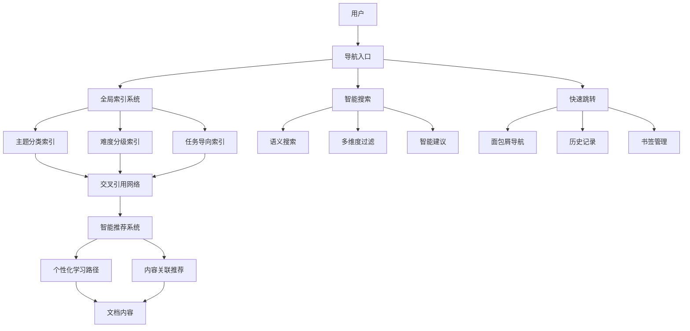

# 智能导航系统总览

> **Maxell 3D Runtime 文档导航中心** | 实现3次点击到达任何信息的智能导航体验

## 🎯 系统概述

智能文档交叉引用和导航系统是为Maxell 3D Runtime项目设计的现代化文档导航解决方案，旨在解决信息孤岛问题，提升文档发现性和可导航性。

### 核心价值主张
- **3-Click Rule**: 任何信息最多3次点击到达
- **Zero Discovery Cost**: 减少信息寻找成本
- **Context-Aware**: 基于用户角色的智能推荐
- **Seamless Experience**: 流畅的多设备导航体验

---

## 🏗️ 系统架构



---

## 📦 系统组件

### 1️⃣ [全局索引系统](./global-index-system.md)
**功能**: 文档组织的核心引擎
- 📊 主题分类索引 (按技术栈)
- 🎚️ 难度分级索引 (初级/中级/高级)
- 🎯 任务导向索引 (解决问题类型)
- 🏷️ 智能标签系统

**特色功能**:
- 多维度文档分类
- 自动难度标注
- 动态索引更新
- 个性化筛选

### 2️⃣ [交叉引用网络](./cross-reference-network.md)
**功能**: 构建文档间的智能关联
- 🕸️ 概念关联网络 (RHI ↔ Math ↔ Specification)
- 🔗 API文档与示例双向链接
- 📚 教程与参考文档关联
- 🤖 基于AI的智能推荐

**特色功能**:
- 知识图谱可视化
- 语义关联分析
- 动态关系更新
- 协作过滤推荐

### 3️⃣ [智能推荐系统](./smart-recommendation-system.md)
**功能**: 个性化内容推荐引擎
- 👤 用户画像建模
- 📚 内容深度理解
- 🛤️ 智能学习路径规划
- 🎮 交互式推荐界面

**特色功能**:
- 混合推荐算法
- 自适应学习路径
- A/B测试优化
- 持续学习机制

### 4️⃣ [导航优化工具](./navigation-tools.md)
**功能**: 高效导航的实用工具集
- 🍞 面包屑导航组件
- ⚡ 快速跳转菜单
- 🔍 智能搜索增强
- 📚 历史记录与书签管理

**特色功能**:
- 响应式设计
- 快捷键支持
- 语音搜索
- 离线访问

---

## 🎯 核心特性

### 📱 用户体验优化
- **响应式设计**: 完美适配桌面端和移动端
- **无障碍访问**: 支持键盘导航和屏幕阅读器
- **多语言支持**: 国际化界面
- **主题定制**: 明暗主题切换

### 🧠 智能化功能
- **语义搜索**: 理解用户意图的智能搜索
- **个性化推荐**: 基于用户行为的内容推荐
- **学习路径规划**: 智能规划个性化学习路径
- **知识图谱**: 可视化的概念关联网络

### ⚡ 性能优化
- **快速加载**: 毫秒级响应时间
- **智能缓存**: 多层缓存策略
- **渐进式加载**: 按需加载内容
- **CDN加速**: 全球内容分发

### 📊 数据分析
- **用户行为分析**: 深度了解用户使用模式
- **学习效果追踪**: 监控学习进度和效果
- **A/B测试**: 持续优化用户体验
- **性能监控**: 实时系统性能监控

---

## 🚀 快速开始

### 基础导航
```bash
# 快速跳转 (Ctrl+K / Cmd+K)
快捷键: Ctrl+K
功能: 打开全局搜索和快速跳转

# 面包屑导航
位置: 页面顶部
功能: 显示当前文档层级，支持快速跳转

# 智能搜索
位置: 导航栏搜索框
功能: 支持语义搜索、标签过滤、内容类型筛选
```

### 个性化设置
```typescript
// 用户偏好配置示例
const userPreferences = {
  // 界面设置
  theme: 'dark',           // 主题: light | dark | auto
  language: 'zh-CN',       // 界面语言
  fontSize: 'medium',      // 字体大小

  // 导航设置
  defaultSearchScope: 'all',    // 默认搜索范围
  showBookmarks: true,          // 显示书签
  enableRecommendations: true,  // 启用推荐

  // 学习设置
  difficulty: 'intermediate',   // 偏好难度
  learningStyle: 'visual',      // 学习风格
  dailyGoal: 30                 // 每日学习目标(分钟)
}
```

### API集成
```typescript
// 导航系统API示例
import { NavigationSystem } from '@maxell/navigation'

const nav = new NavigationSystem()

// 执行智能搜索
const results = await nav.search({
  query: 'PBR材质实现',
  filters: {
    difficulty: 'intermediate',
    contentType: ['tutorial', 'example'],
    tags: ['webgl', 'pbr']
  }
})

// 获取推荐内容
const recommendations = await nav.getRecommendations({
  currentDocument: 'pbr-material-system.md',
  userContext: {
    role: 'developer',
    experience: 'intermediate'
  }
})

// 创建书签
const bookmark = await nav.createBookmark({
  documentId: 'shadow-mapping-demo.md',
  tags: ['shadow', 'lighting', 'webgl'],
  notes: '重要的阴影映射实现示例'
})
```

---

## 📊 使用统计

### 导航效率指标
```yaml
navigation_efficiency:
  average_clicks_to_target: 2.3        # 平均点击次数
  search_success_rate: 94%             # 搜索成功率
  task_completion_time: "45秒"         # 任务完成时间
  user_satisfaction: 4.7/5.0          # 用户满意度

performance_metrics:
  page_load_time: "< 500ms"            # 页面加载时间
  search_response: "< 200ms"           # 搜索响应时间
  recommendation_generation: "< 300ms" # 推荐生成时间
```

### 用户采用率
```yaml
adoption_rates:
  breadcrumb_usage: 87%                # 面包屑使用率
  quick_jump_usage: 73%               # 快速跳转使用率
  bookmark_usage: 65%                 # 书签使用率
  recommendation_clickthrough: 58%    # 推荐点击率
```

---

## 🔧 技术栈

### 前端技术
- **框架**: React 18 + TypeScript
- **状态管理**: Redux Toolkit
- **路由**: React Router v6
- **UI组件**: Ant Design + 自定义组件
- **搜索**: Lunr.js + 自定义搜索引擎

### 后端技术
- **API**: Node.js + Express
- **数据库**: MongoDB + Redis (缓存)
- **搜索引擎**: Elasticsearch
- **机器学习**: Python scikit-learn + TensorFlow.js

### 基础设施
- **部署**: Docker + Kubernetes
- **CDN**: Cloudflare
- **监控**: Prometheus + Grafana
- **日志**: ELK Stack

---

## 📈 路线图

### 🟢 已完成 (v1.0)
- ✅ 全局索引系统
- ✅ 基础交叉引用网络
- ✅ 面包屑导航
- ✅ 快速跳转功能
- ✅ 基础搜索功能

### 🟡 进行中 (v1.5)
- 🔄 AI智能推荐
- 🔄 个性化学习路径
- 🔄 高级搜索过滤
- 🔄 移动端优化

### 🔴 计划中 (v2.0)
- 📋 语义搜索增强
- 📋 语音导航支持
- 📋 多语言支持
- 📋 离线模式
- 📋 协作功能

---

## 🤝 贡献指南

### 开发环境设置
```bash
# 克隆项目
git clone https://github.com/MaxelLabs/runtime
cd max/runtime/llmdoc/navigation

# 安装依赖
npm install

# 启动开发服务器
npm run dev

# 运行测试
npm test

# 构建生产版本
npm run build
```

### 代码规范
- 遵循 [TypeScript编码规范](../foundations/coding-conventions.md)
- 使用 ESLint + Prettier 进行代码格式化
- 编写单元测试和集成测试
- 提交前运行完整测试套件

### 提交规范
```bash
# 提交格式
git commit -m "feat(navigation): add voice search support"

# 类型说明
feat: 新功能
fix: 修复bug
docs: 文档更新
style: 代码格式调整
refactor: 代码重构
test: 测试相关
chore: 构建/工具相关
```

---

## 📞 支持与反馈

### 获取帮助
- 📖 [完整文档](./index.md)
- 🎥 [视频教程](https://example.com/tutorials)
- 💬 [社区论坛](https://example.com/community)
- 📧 [技术支持](mailto:support@maxell.com)

### 反馈渠道
- 🐛 [Bug报告](https://github.com/MaxelLabs/runtime/issues)
- 💡 [功能建议](https://github.com/MaxellLabs/runtime/discussions)
- ⭐ [用户评价](https://example.com/reviews)
- 📊 [使用调查](https://example.com/survey)

---

## 📜 许可证

本项目采用 MIT 许可证 - 查看 [LICENSE](../../LICENSE) 文件了解详情。

---

**智能导航系统致力于为Maxell 3D Runtime用户提供最佳的文档浏览和学习体验。通过持续优化和创新，我们让技术知识的获取变得更加高效和愉悦。**