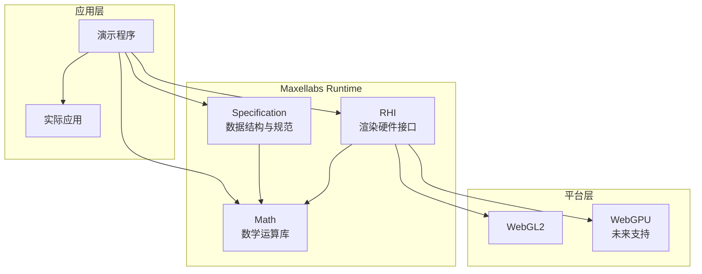

# Maxellabs API v2 总览

## 🎯 学习目标
完成本总览后，您将能够：
- 理解Maxellabs Runtime的三层架构设计
- 掌握RHI、Math、Specification三大核心库的职责分工
- 建立WebGL2渲染应用的完整工作流
- 了解性能优化和资源管理的最佳实践
- 规划从基础到高级的学习路径

## ⚠️ 禁止事项
- **禁止** 在同步函数中执行异步操作 - 遵循异步编程模式
- **禁止** 在渲染循环中重复创建对象 - 使用对象池和缓存
- **禁止** 忽略资源释放 - 必须调用dispose()方法
- **禁止** 混用不同的坐标系统 - 严格遵循右手坐标系
- **禁止** 在片元着色器中直接修改深度值

## 🔧 核心接口定义

### IRHIDevice
```typescript
interface IRHIDevice {
  // 资源创建
  createBuffer(descriptor: BufferDescriptor): Buffer;
  createTexture(descriptor: TextureDescriptor): Texture;
  createSampler(descriptor: SamplerDescriptor): Sampler;
  createRenderPipeline(descriptor: RenderPipelineDescriptor): RenderPipeline;
  createBindGroup(descriptor: BindGroupDescriptor): BindGroup;

  // 命令编码
  createCommandEncoder(): CommandEncoder;

  // 资源管理
  flush(): void;
  lose(): void;
}
```

### IDeviceFactory
```typescript
interface IDeviceFactory {
  createWebGL2Device(canvas: HTMLCanvasElement, options?: DeviceOptions): Promise<IRHIDevice>;
  createWebGPUDevice(canvas: HTMLCanvasElement, options?: DeviceOptions): Promise<IRHIDevice>;
  getSupportedAPIs(): ('webgl2' | 'webgpu')[];
}
```

### IMathLibrary
```typescript
interface IMathLibrary {
  // 基础数学对象
  Vec2: typeof Vec2;
  Vec3: typeof Vec3;
  Vec4: typeof Vec4;
  Mat3: typeof Mat3;
  Mat4: typeof Mat4;
  Quat: typeof Quat;

  // 对象池
  getObjectPool(): IObjectPool;

  // 工具函数
  degToRad(degrees: number): number;
  radToDeg(radians: number): number;
  clamp(value: number, min: number, max: number): number;
}
```

### ISpecificationLibrary
```typescript
interface ISpecificationLibrary {
  // 核心类型
  Frame: typeof Frame;
  Material: typeof Material;
  Animation: typeof Animation;

  // USD支持
  USDStage: typeof USDStage;
  USDLayer: typeof USDLayer;
  USDPrim: typeof USDPrim;
}
```

## 📝 Few-Shot 示例

### 问题1：WebGL2设备初始化失败
**解决方案**：
```typescript
async function initializeDevice(canvas: HTMLCanvasElement): Promise<IRHIDevice> {
  try {
    // 检查WebGL2支持
    if (!navigator.gpu && !canvas.getContext('webgl2')) {
      throw new Error('WebGL2 not supported in this browser');
    }

    // 使用工厂模式创建设备
    const factory = new DeviceFactory();
    const device = await factory.createWebGL2Device(canvas, {
      antialias: true,
      preserveDrawingBuffer: false
    });

    return device;
  } catch (error) {
    console.error('Failed to initialize RHI device:', error);
    // 回退到软件渲染或显示错误信息
    throw error;
  }
}
```

### 问题2：缓冲区数据更新性能问题
**解决方案**：
```typescript
// 错误方式：每次更新都创建新缓冲区
function badUpdate(data: Float32Array) {
  const buffer = device.createBuffer({
    size: data.byteLength,
    usage: BufferUsage.Vertex,
    data: data
  });
}

// 正确方式：复用缓冲区，使用subData更新
class DynamicVertexBuffer {
  private buffer: Buffer;
  private capacity: number;

  constructor(device: IRHIDevice, capacity: number) {
    this.capacity = capacity;
    this.buffer = device.createBuffer({
      size: capacity * Float32Array.BYTES_PER_ELEMENT,
      usage: BufferUsage.Vertex | BufferUsage.CopyDst
    });
  }

  update(data: Float32Array, offset: number = 0) {
    this.buffer.setSubData(data, offset * Float32Array.BYTES_PER_ELEMENT);
  }
}
```

### 问题3：着色器编译错误处理
**解决方案**：
```typescript
async function createShader(device: IRHIDevice, source: string, type: 'vertex' | 'fragment'): Promise<ShaderModule> {
  try {
    return device.createShaderModule({
      code: source,
      hint: type
    });
  } catch (error) {
    console.error(`Shader compilation failed (${type}):`, error);

    // 提供详细的错误信息
    if (error.shaderInfoLog) {
      console.error('Shader info log:', error.shaderInfoLog);
    }

    // 尝试使用备用着色器
    return getFallbackShader(type);
  }
}

function getFallbackShader(type: 'vertex' | 'fragment'): ShaderModule {
  const fallbackSource = type === 'vertex'
    ? fallbackVertexShader
    : fallbackFragmentShader;

  return device.createShaderModule({ code: fallbackSource, hint: type });
}
```

## 架构概览

Maxellabs Runtime 由三个核心库组成，提供了完整的 WebGL2 渲染抽象层。



## 核心库说明

### 1. RHI (Rendering Hardware Interface) - 渲染硬件接口
**职责**：提供跨平台的渲染抽象层，封装 WebGL2/WebGPU 的底层操作。

**核心功能**：
- 设备管理和状态控制
- 资源管理（Buffer、Texture、Sampler等）
- 命令缓冲区和渲染管线
- 着色器编译和绑定管理

### 2. Math - 数学运算库
**职责**：提供高性能的3D数学运算，支持图形学计算需求。

**核心功能**：
- 向量、矩阵、四元数运算
- 几何体操作和变换
- 对象池优化，减少GC压力
- 模块化设计，支持按需引入

### 3. Specification - 数据规范库
**职责**：定义渲染系统的数据结构和接口规范。

**核心功能**：
- 核心类型定义（Frame、Material等）
- 动画系统数据结构
- 渲染管线规范
- USD（Universal Scene Description）支持

## 快速开始

### 基础渲染流程

```typescript
// 1. 初始化设备
const device = new WebGLDevice(canvas);

// 2. 创建资源
const vertexBuffer = device.createBuffer({
  size: vertexData.length * 4,
  usage: BufferUsage.Vertex,
  data: new Float32Array(vertexData)
});

const texture = device.createTexture({
  width: 512,
  height: 512,
  format: TextureFormat.RGBA8Unorm,
  usage: TextureUsage.TextureBinding | TextureUsage.CopyDst
});

// 3. 创建渲染管线
const pipeline = device.createRenderPipeline({
  vertex: {
    module: vertexShader,
    entryPoint: 'main'
  },
  fragment: {
    module: fragmentShader,
    entryPoint: 'main'
  },
  primitive: {
    topology: PrimitiveTopology.TriangleList
  }
});

// 4. 渲染
const commandEncoder = device.createCommandEncoder();
const renderPass = commandEncoder.beginRenderPass({
  colorAttachments: [{
    view: texture.createView(),
    loadOp: LoadOp.Clear,
    storeOp: StoreOp.Store
  }]
});

renderPass.setPipeline(pipeline);
renderPass.setVertexBuffer(0, vertexBuffer);
renderPass.draw(6);
renderPass.end();

device.submit(commandEncoder.finish());
```

### 数学运算示例

```typescript
import { Vec3, Mat4, Quat } from '@maxellabs/math';

// 向量运算
const position = new Vec3(1, 2, 3);
const direction = new Vec3(0, 1, 0);
const distance = position.distanceTo(direction);

// 矩阵变换
const model = Mat4.identity();
model.translate(position);
model.rotate(45, Vec3.up());

// 四元数旋转
const rotation = Quat.fromEuler(0, Math.PI / 4, 0);
const rotated = rotation.transformVector(direction);
```

## 常用使用模式

### 1. 资源生命周期管理

```typescript
class ResourceManager {
  private buffers: Map<string, Buffer> = new Map();
  private textures: Map<string, Texture> = new Map();

  createBuffer(name: string, desc: BufferDescriptor): Buffer {
    const buffer = device.createBuffer(desc);
    this.buffers.set(name, buffer);
    return buffer;
  }

  dispose() {
    // 清理所有资源
    this.buffers.forEach(buffer => buffer.destroy());
    this.textures.forEach(texture => texture.destroy());
    this.buffers.clear();
    this.textures.clear();
  }
}
```

### 2. 命令缓冲区批处理

```typescript
const commandEncoder = device.createCommandEncoder();

// 批量上传纹理数据
textures.forEach((texture, index) => {
  commandEncoder.copyBufferToTexture({
    buffer: uploadBuffers[index],
    bytesPerRow: width * 4
  }, {
    texture,
    origin: { x: 0, y: 0, z: 0 }
  }, {
    width, height, depthOrArrayLayers: 1
  });
});

device.submit(commandEncoder.finish());
```

### 3. 着色器资源绑定

```typescript
const bindGroup = device.createBindGroup({
  layout: pipeline.getBindGroupLayout(0),
  entries: [
    {
      binding: 0,
      resource: { buffer: uniformBuffer }
    },
    {
      binding: 1,
      resource: texture.createView()
    },
    {
      binding: 2,
      resource: device.createSampler({
        minFilter: FilterMode.Linear,
        magFilter: FilterMode.Linear
      })
    }
  ]
});
```

## 性能优化建议

### 1. 数学运算优化
- 使用对象池减少GC压力
- 批量运算避免重复创建临时对象
- 选择合适的数据类型（Float32Array vs Array）

### 2. 渲染优化
- 合并绘制调用，减少状态切换
- 使用实例化渲染大量相似对象
- 合理管理资源生命周期

### 3. 内存管理
- 及时释放不再使用的资源
- 复用缓冲区和纹理
- 避免频繁创建/销毁对象

## 学习路径

1. **入门**：从 [RHI 快速开始](./rhi/) 开始，了解基础渲染概念
2. **进阶**：学习 [Math 库使用](./math/)，掌握3D数学运算
3. **高级**：深入 [Specification 规范](./specification/)，理解系统架构
4. **实践**：参考 [示例代码](../demos/)，动手实践

## API 索引

- [RHI 完整API](./rhi/) - 渲染硬件接口
- [Math 完整API](./math/) - 数学运算库
- [Specification 完整API](./specification/) - 数据规范

## 版本历史

- **v2.0** - 当前版本，重构的API架构
- **v1.x** - 早期版本，向后兼容

## 更多资源

- [示例演示](../demos/)
- [架构指南](../architecture/)
- [最佳实践](../guides/)