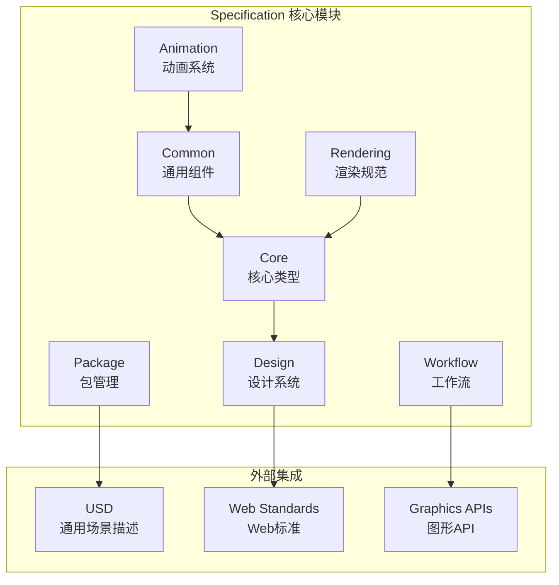

# Specification API 文档

## 概述

Specification 库定义了 Maxellabs Runtime 的核心数据结构、接口规范和系统约定。它为整个运行时提供了类型安全的基础，确保各个组件之间的数据一致性和互操作性。

## 架构设计



## 核心类型系统

### 1. 基础类型定义

```typescript
// 基础数值类型
export type Float32 = number;
export type Uint32 = number;
export type Int32 = number;
export type Bool = boolean;

// 标识符类型
export type UUID = string;
export type ResourceId = string;
export type AssetId = string;

// 尺寸和范围
export interface Size2D {
  width: number;
  height: number;
}

export interface Size3D extends Size2D {
  depth?: number;
}

export interface Range1D {
  min: number;
  max: number;
}

export interface Range2D {
  x: Range1D;
  y: Range1D;
}
```

### 2. 颜色和材质

```typescript
// 颜色表示
export interface ColorRGB {
  r: number; // [0, 1]
  g: number; // [0, 1]
  b: number; // [0, 1]
}

export interface ColorRGBA extends ColorRGB {
  a: number; // [0, 1]
}

export interface ColorHSV {
  h: number; // [0, 360]
  s: number; // [0, 1]
  v: number; // [0, 1]
}

// 材质属性
export interface PBRMaterial {
  // 基础属性
  baseColor: ColorRGBA;
  metallic: number;     // [0, 1]
  roughness: number;    // [0, 1]
  normalScale: number;
  occlusionStrength: number;

  // 纹理引用
  baseColorTexture?: TextureRef;
  metallicRoughnessTexture?: TextureRef;
  normalTexture?: TextureRef;
  occlusionTexture?: TextureRef;
  emissiveTexture?: TextureRef;

  // 发光
  emissive: ColorRGB;
  emissiveIntensity: number;

  // 透明度
  alphaMode: 'OPAQUE' | 'MASK' | 'BLEND';
  alphaCutoff: number;
  doubleSided: boolean;
}
```

### 3. 变换系统

```typescript
// 变换组件
export interface Transform3D {
  position: Vec3;
  rotation: Quat;
  scale: Vec3;

  // 矩阵缓存（可选）
  matrix?: Mat4;
  worldMatrix?: Mat4;
  normalMatrix?: Mat3;
}

// 变换层级
export interface TransformNode {
  id: UUID;
  name?: string;
  transform: Transform3D;
  children: TransformNode[];
  parent?: UUID;

  // 层级属性
  visible: boolean;
  inheritPosition: boolean;
  inheritRotation: boolean;
  inheritScale: boolean;
}

// 包围盒
export interface BoundingBox {
  min: Vec3;
  max: Vec3;
  center?: Vec3;
  size?: Vec3;
}
```

## 动画系统

### 1. 动画数据结构

```typescript
// 动画时间线
export interface AnimationTimeline {
  duration: number;  // 总时长（秒）
  loop: boolean;     // 是否循环
  playbackSpeed: number; // 播放速度

  // 时间映射
  timeMapping?: {
    input: number[];  // 关键时间点
    output: number[]; // 映射后的时间
    interpolation: 'linear' | 'step' | 'cubic-spline';
  };
}

// 动画通道
export interface AnimationChannel {
  target: {
    node: UUID;           // 目标节点ID
    path: AnimationPath;  // 动画路径
  };
  sampler: UUID;          // 采样器ID
}

// 动画路径类型
export type AnimationPath =
  | 'translation'
  | 'rotation'
  | 'scale'
  | 'weights'
  | 'material.baseColor'
  | 'material.metallic'
  | 'material.roughness';

// 动画采样器
export interface AnimationSampler {
  input: Accessor;      // 时间输入
  output: Accessor;     // 值输出
  interpolation: InterpolationType;
}

export type InterpolationType =
  | 'LINEAR'
  | 'STEP'
  | 'CUBICSPLINE';

// 动画片段
export interface AnimationClip {
  name: string;
  duration: number;
  channels: AnimationChannel[];
  samplers: AnimationSampler[];
}
```

### 2. 动画状态

```typescript
// 动画状态机
export interface AnimationState {
  name: string;
  clip: UUID;
  speed: number;
  loop: boolean;
  weight: number;

  // 混合控制
  blendInDuration?: number;
  blendOutDuration?: number;

  // 过渡
  transitions: AnimationTransition[];
}

// 动画过渡
export interface AnimationTransition {
  targetState: string;
  duration: number;
  offset: number;
  exitTime?: number;
  hasExitTime: boolean;
  conditions?: AnimationCondition[];
}

// 动画条件
export interface AnimationCondition {
  parameter: string;
  mode: 'Equal' | 'NotEqual' | 'Greater' | 'Less' | 'GreaterOrEqual' | 'LessOrEqual';
  threshold: number;
}

// 动画控制器
export interface AnimationController {
  layers: AnimationLayer[];
  parameters: AnimationParameter[];
  stateMachine?: AnimationStateMachine;
}
```

### 3. 骨骼动画

```typescript
// 骨骼定义
export interface Skeleton {
  joints: Joint[];
  inverseBindMatrices: Accessor;
  root?: UUID;
}

// 关节
export interface Joint {
  id: UUID;
  name?: string;
  parent?: UUID;
  transform: Transform3D;

  // 关节属性
  limit?: JointLimit;
  stiffness?: number;
  damping?: number;
}

// 关节限制
export interface JointLimit {
  type: 'swing' | 'twist' | 'angular';
  min: Vec3;
  max: Vec3;
  stiffness: Vec3;
  damping: Vec3;
}

// 蒙皮
export interface Skin {
  skeleton: UUID;
  joints: UUID[];
  inverseBindMatrices: Accessor;
  jointsCount?: number;
}
```

## 渲染规范

### 1. 渲染管线

```typescript
// 渲染管线描述
export interface RenderPipeline {
  name: string;
  type: 'forward' | 'deferred' | 'compute';

  // 着色器阶段
  vertex?: ShaderStage;
  fragment?: ShaderStage;
  compute?: ShaderStage;

  // 渲染状态
  primitive: PrimitiveState;
  depthStencil?: DepthStencilState;
  colorTarget?: ColorTargetState[];
  multisample?: MultisampleState;

  // 布局
  layout: PipelineLayout;
}

// 渲染状态
export interface PrimitiveState {
  topology: PrimitiveTopology;
  stripIndexFormat?: IndexFormat;
  frontFace: FrontFaceMode;
  cullMode: CullMode;
  unclippedDepth?: boolean;
}

export interface DepthStencilState {
  format: TextureFormat;
  depthWriteEnabled: boolean;
  depthCompare: CompareFunction;
  stencilFront?: StencilFaceState;
  stencilBack?: StencilFaceState;
  depthBias?: number;
  depthBiasSlopeScale?: number;
  depthBiasClamp?: number;
}

// 顶点格式
export interface VertexFormat {
  arrayStride: number;
  stepMode: VertexStepMode;
  attributes: VertexAttribute[];
}

export interface VertexAttribute {
  format: VertexFormatType;
  offset: number;
  shaderLocation: number;
}
```

### 2. 帧缓冲系统

```typescript
// 帧描述
export interface Frame {
  id: UUID;
  timestamp: number;
  index: number;

  // 渲染目标
  colorAttachments: ColorAttachment[];
  depthStencilAttachment?: DepthStencilAttachment;

  // 视口
  viewport?: Viewport;
  scissor?: Scissor;

  // 渲染统计
  drawCalls: number;
  triangles: number;
  vertices: number;

  // 性能指标
  cpuTime?: number;
  gpuTime?: number;
}

// 颜色附件
export interface ColorAttachment {
  view: TextureView;
  resolveTarget?: TextureView;
  clearValue?: ColorRGBA;
  loadOp: LoadOp;
  storeOp: StoreOp;
}

// 深度模板附件
export interface DepthStencilAttachment {
  view: TextureView;
  depthClearValue?: number;
  depthLoadOp: LoadOp;
  depthStoreOp: StoreOp;
  depthReadOnly?: boolean;
  stencilClearValue?: number;
  stencilLoadOp: LoadOp;
  stencilStoreOp: StoreOp;
  stencilReadOnly?: boolean;
}
```

### 3. 材质系统

```typescript
// 材质定义
export interface Material {
  name?: string;
  type: MaterialType;

  // 基础属性
  alphaMode: AlphaMode;
  alphaCutoff: number;
  doubleSided: boolean;

  // 着色器
  shader?: UUID;
  parameters: MaterialParameter[];

  // 纹理
  textures: MaterialTexture[];

  // 渲染状态
  blend?: BlendState;
  cull?: CullMode;
  depthWrite?: boolean;
  depthTest?: boolean;
}

export type MaterialType =
  | 'unlit'
  | 'pbr'
  | 'toon'
  | 'glass'
  | 'custom';

// 材质参数
export interface MaterialParameter {
  name: string;
  type: ParameterType;
  value: ParameterValue;
  range?: [number, number];
}

export type ParameterType =
  | 'float'
  | 'vec2'
  | 'vec3'
  | 'vec4'
  | 'int'
  | 'bool'
  | 'color'
  | 'texture';

export type ParameterValue =
  | number
  | Vec2
  | Vec3
  | Vec4
  | boolean
  | ColorRGBA
  | TextureRef;
```

## 通用场景描述 (USD) 支持

### 1. 基础USD类型

```typescript
// USD属性类型
export type USDAttributeType =
  | 'bool'
  | 'uchar'
  | 'int'
  | 'uint'
  | 'int64'
  | 'uint64'
  | 'half'
  | 'float'
  | 'double'
  | 'token'
  | 'string'
  | 'asset'
  | 'vector3f'
  | 'vector3d'
  | 'matrix4d';

// USD属性
export interface USDAttribute {
  name: string;
  type: USDAttributeType;
  value: any;
  array?: boolean;
  timeSamples?: USDTimeSample[];
}

export interface USDTimeSample {
  time: number;
  value: any;
}

// USD原始对象
export interface USDPrim {
  path: string;  // /World/Characters/Character1
  typeName?: string;
  attributes: Map<string, USDAttribute>;
  children: USDPrim[];
}
```

### 2. USD场景结构

```typescript
// USD舞台
export interface USDStage {
  defaultPrim?: string;
  upAxis: 'Y' | 'Z';
  metersPerUnit: number;
  startTimeCode: number;
  endTimeCode: number;
  framesPerSecond: number;

  // 层级
  rootLayer: USDLayer;
  sessionLayers?: USDLayer[];

  // 场景图
  prims: Map<string, USDPrim>;
}

// USD层
export interface USDLayer {
  identifier: string;  // 文件路径或标识符
  version?: string;

  // 元数据
  documentation?: string;
  customLayerData?: any;

  // 子层
  subLayers: USDSLayer[];
}

export interface USDSLayer {
  layer: string;
  offset?: number;
}

// USD材质
export interface USDMaterial {
  name: string;
  surface?: USDMaterialInput;
  displacement?: USDMaterialInput;
  volume?: USDMaterialInput;
}

export interface USDMaterialInput {
  id: string;  // 预定义的着色器ID
  parameters: Map<string, any>;
}
```

## 设计系统

### 1. 主题系统

```typescript
// 主题定义
export interface Theme {
  name: string;
  version: string;

  // 颜色
  colors: {
    primary: ColorPalette;
    secondary: ColorPalette;
    neutral: ColorPalette;
    semantic: SemanticColors;
  };

  // 排版
  typography: TypographySystem;

  // 间距
  spacing: SpacingSystem;

  // 阴影
  shadows: ShadowSystem;

  // 动画
  animation: AnimationSystem;
}

// 颜色调色板
export interface ColorPalette {
  50: ColorRGBA;
  100: ColorRGBA;
  200: ColorRGBA;
  300: ColorRGBA;
  400: ColorRGBA;
  500: ColorRGBA;  // 主色
  600: ColorRGBA;
  700: ColorRGBA;
  800: ColorRGBA;
  900: ColorRGBA;
}

// 语义颜色
export interface SemanticColors {
  background: ColorRGBA;
  foreground: ColorRGBA;
  surface: ColorRGBA;
  border: ColorRGBA;
  error: ColorRGBA;
  warning: ColorRGBA;
  success: ColorRGBA;
  info: ColorRGBA;
}
```

### 2. 组件规范

```typescript
// 组件属性
export interface ComponentProps {
  id?: string;
  className?: string;
  style?: CSSProperties;
  theme?: Theme;

  // 可访问性
  aria?: AriaAttributes;
  role?: string;
  tabIndex?: number;

  // 事件
  onClick?: EventHandler;
  onHover?: EventHandler;
  onFocus?: EventHandler;
  onBlur?: EventHandler;
}

// 布局组件
export interface LayoutProps extends ComponentProps {
  display: 'flex' | 'grid' | 'block' | 'inline';
  direction?: 'row' | 'column' | 'row-reverse' | 'column-reverse';
  wrap?: 'wrap' | 'nowrap' | 'wrap-reverse';
  justify?: 'start' | 'end' | 'center' | 'between' | 'around';
  align?: 'start' | 'end' | 'center' | 'stretch';
  gap?: number | string;
  padding?: Spacing;
  margin?: Spacing;
}
```

## 工作流定义

### 1. 工作流结构

```typescript
// 工作流定义
export interface Workflow {
  id: UUID;
  name: string;
  version: string;
  description?: string;

  // 节点和连接
  nodes: WorkflowNode[];
  connections: WorkflowConnection[];

  // 输入输出
  inputs: WorkflowPort[];
  outputs: WorkflowPort[];

  // 执行配置
  schedule?: WorkflowSchedule;
  retryPolicy?: RetryPolicy;
}

// 工作流节点
export interface WorkflowNode {
  id: UUID;
  type: string;
  name?: string;
  position: Vec2;

  // 输入输出端口
  inputs: WorkflowPort[];
  outputs: WorkflowPort[];

  // 配置
  configuration: any;

  // 状态
  status: NodeStatus;
  startTime?: number;
  endTime?: number;
  error?: string;
}

// 工作流端口
export interface WorkflowPort {
  id: string;
  name: string;
  type: PortType;
  direction: 'input' | 'output';
  required?: boolean;
  defaultValue?: any;
}

export type PortType =
  | 'data'
  | 'stream'
  | 'trigger'
  | 'asset';
```

## 实用工具类型

### 1. 泛型工具

```typescript
// 深度只读
export type DeepReadonly<T> = {
  readonly [P in keyof T]: T[P] extends object ? DeepReadonly<T[P]> : T[P];
};

// 深度部分
export type DeepPartial<T> = {
  [P in keyof T]?: T[P] extends object ? DeepPartial<T[P]> : T[P];
};

// 严格 omit
export type StrictOmit<T, K extends keyof T> = {
  [P in keyof T as P extends K ? never : P]: T[P];
};

// 类型守卫
export function isString(value: unknown): value is string {
  return typeof value === 'string';
}

export function isNumber(value: unknown): value is number {
  return typeof value === 'number' && !isNaN(value);
}
```

### 2. 序列化支持

```typescript
// 可序列化接口
export interface Serializable {
  serialize(): Uint8Array;
  static deserialize(data: Uint8Array): any;
}

// JSON序列化支持
export interface JSONSerializable {
  toJSON(): object;
  static fromJSON(json: object): any;
}
```

## API 参考

- [核心类型详解](./core-types/)
- [动画系统](./animation/)
- [渲染规范](./rendering/)
- [USD集成示例](./examples/)

## 更多资源

- [快速开始](../overview.md)
- [架构指南](../architecture/)
- [最佳实践](../guides/)