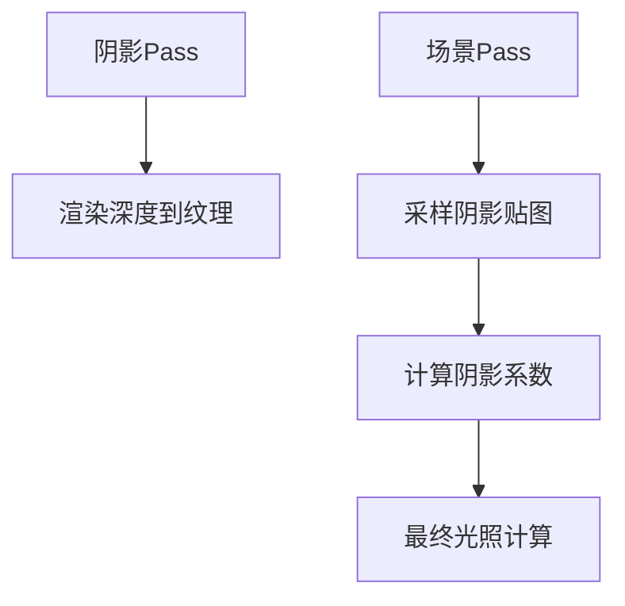

# 阴影贴图 Demo 参考文档

## 🎯 学习目标
完成本Demo后，您将能够：
- 实现完整的两遍阴影贴图渲染管线
- 配置和使用PCF软阴影算法
- 解决常见的阴影渲染问题（阴影痤疮、Peter Panning等）
- 优化阴影贴图性能和质量平衡
- 扩展到级联阴影贴图等高级技术

## ⚠️ 禁止事项
- **禁止** 在阴影Pass中启用面剔除 - 会导致背面不投射阴影
- **禁止** 使用过大的阴影偏移值 - 会产生Peter Panning效果
- **禁止** 在移动设备上使用4096分辨率阴影贴图
- **禁止** 忽视深度缓冲精度限制 - 调整近远平面
- **禁止** 在PCF采样中使用Nearest滤波器

## 🔧 关键实现修复 (v1.1.0)

### 1. 矩阵分离：深度Pass vs PBR Pass

**问题**：深度 Pass 和 PBR Pass 共用同一个 `lightSpaceMatrix`，导致矩阵被污染。

**原因**：
- 深度 Pass 需要 `Projection * View * Model` 矩阵
- PBR Pass 阴影采样只需要 `Projection * View` 矩阵

**解决方案**：
```typescript
// ✅ 正确：分离两个矩阵
const lightSpaceMatrix = new MMath.Matrix4();      // PBR Pass 用
const depthLightSpaceMatrix = new MMath.Matrix4(); // 深度 Pass 专用

// 深度 Pass：包含 Model 矩阵
depthLightSpaceMatrix.copyFrom(lightProjectionMatrix);
depthLightSpaceMatrix.multiply(lightViewMatrix);
depthLightSpaceMatrix.multiply(modelMatrix);  // ← 包含 Model

// PBR Pass：不含 Model 矩阵（在 shader 中乘）
lightSpaceMatrix.copyFrom(lightProjectionMatrix);
lightSpaceMatrix.multiply(lightViewMatrix);
pbrMaterial.updateLightSpaceMatrix(lightSpaceMatrix);  // ← 不含 Model
```

### 2. 地面阴影规则

**规则**：地面只接收阴影，不投射阴影。

**实现**：
```typescript
// 深度 Pass：只渲染投射阴影的物体
// ⚠️ 注意：地面不渲染到 Shadow Map
depthPass.setVertexBuffer(0, sphereVertexBuffer);  // ✅ 球体
depthPass.setVertexBuffer(0, cube1VertexBuffer);   // ✅ 立方体
// planeVertexBuffer 不渲染到深度 Pass            // ❌ 地面

// 场景 Pass：所有物体都渲染（包括地面）
renderPass.setVertexBuffer(0, planeVertexBuffer);  // ✅ 地面接收阴影
```

### 3. 环境光阴影因子

**问题**：阴影只影响直接光照，环境光过强时阴影不可见。

**解决方案**：
```glsl
// 阴影因子也影响环境光（减半影响，保留全局照明）
float ambientShadow = mix(1.0, shadowFactor, 0.5);

// 应用到环境光
vec3 ambient = (kD_env * diffuse * ambientShadow + specular) * uAmbientStrength;
//                                 ↑ 阴影对漫反射的影响
//                                   镜面反射保持不变（保留高光）
```

## 🔧 核心接口定义

### IShadowMapRenderer
```typescript
interface IShadowMapRenderer {
  // 渲染深度到阴影贴图
  renderDepthPass(lights: Light[], scene: Renderable[]): void;

  // 应用阴影到场景
  renderScenePass(camera: Camera, scene: Renderable[]): void;

  // 设置阴影参数
  setShadowBias(bias: number): void;
  setPCFSamples(samples: number): void;
  setShadowMapResolution(resolution: number): void;
}
```

### IRenderTarget
```typescript
interface IRenderTarget {
  width: number;
  height: number;
  depthTexture?: Texture;
  colorTextures: Texture[];

  // 创建深度纹理
  createDepthTexture(format: TextureFormat): Texture;

  // 绑定为渲染目标
  bind(): void;

  // 解除绑定
  unbind(): void;
}
```

### IShadowShader
```typescript
interface IShadowShader {
  // 深度Pass着色器
  depthVertexShader: ShaderModule;
  depthFragmentShader: ShaderModule;

  // 场景Pass着色器
  sceneVertexShader: ShaderModule;
  sceneFragmentShader: ShaderModule;

  // 设置uniform变量
  setLightSpaceMatrix(matrix: Mat4): void;
  setShadowBias(bias: number): void;
  setPCFSamples(samples: number): void;
}
```

## 📝 Few-Shot 示例

### 问题1：阴影出现条纹状瑕疵（Shadow Acne）
**解决方案**：
```typescript
// 调整阴影偏移
const bias = 0.005; // 从0.001增加到0.005
shadowRenderer.setShadowBias(bias);

// 或者使用基于法线的动态偏移
const dynamicBias = Math.max(0.001, dot(normal, lightDirection) * 0.001);
shadowRenderer.setShadowBias(dynamicBias);

// 确保使用前面剔除渲染深度
const depthPipeline = device.createRenderPipeline({
  cullMode: 'front', // 关键：前面剔除避免自阴影
  depthWriteEnabled: true,
  depthCompare: 'less'
});
```

### 问题2：PCF软阴影效果不明显
**解决方案**：
```typescript
// 增加PCF采样数
shadowRenderer.setPCFSamples(9); // 3x3 PCF

// 使用线性滤波器
const shadowSampler = device.createSampler({
  minFilter: 'linear',
  magFilter: 'linear',
  addressModeU: 'clamp-to-edge',
  addressModeV: 'clamp-to-edge',
  compare: 'less' // 比较采样器
});

// 调整纹理分辨率
shadowRenderer.setShadowMapResolution(2048); // 提高分辨率
```

### 问题3：阴影与物体分离（Peter Panning）
**解决方案**：
```typescript
// 减少阴影偏移
const bias = 0.001; // 过大的偏移导致分离
shadowRenderer.setShadowBias(bias);

// 使用深度偏移常量
const depthBiasSlopeFactor = 2.0;
const depthBiasConstantFactor = 0.0;

// 在着色器中动态计算偏移
const dynamicBias = depthBiasConstantFactor +
  depthBiasSlopeFactor * tan(acos(dot(normal, lightDirection)));
```

## 概述

阴影贴图（Shadow Mapping）Demo 是第四层高级渲染技术的第一个演示，展示了动态阴影渲染的核心技术。本 Demo 使用深度纹理和两遍渲染技术，实现了实时的软阴影效果。

## 技术特点

### 1. 深度纹理渲染
- **格式**: DEPTH24_UNORM 精度深度纹理
- **工具**: RenderTarget 工具类管理阴影贴图
- **分辨率**: 可动态调节（512-4096）
- **性能**: 平衡质量和渲染速度

### 2. 两遍渲染技术


#### 阴影Pass（Depth Pass）
- 目标：只渲染深度信息到阴影贴图
- 着色器：最小化，只计算位置
- 管线：前面剔除，避免自阴影
- 输出：深度纹理

#### 场景Pass（Lighting Pass）
- 目标：渲染最终场景，包含阴影
- 着色器：完整光照 + 阴影计算
- 管线：标准光照管线
- 输入：阴影贴图 + 场景几何

### 3. PCF 软阴影
支持三种采样模式：
- **1x1**: 硬阴影（最快）
- **2x2**: 基础软阴影
- **3x3**: 高质量软阴影

#### PCF 算法实现
```glsl
float calculateShadow(vec4 lightSpacePos, float bias) {
  // 透视除法
  vec3 projCoords = lightSpacePos.xyz / lightSpacePos.w;
  projCoords = projCoords * 0.5 + 0.5;  // [-1,1] -> [0,1]

  float currentDepth = projCoords.z;
  float shadow = 0.0;
  vec2 texelSize = 1.0 / vec2(textureSize(uShadowMap, 0));

  // 3x3 PCF 采样
  for (int x = -1; x <= 1; x++) {
    for (int y = -1; y <= 1; y++) {
      vec2 offset = vec2(float(x), float(y)) * texelSize;
      float pcfDepth = texture(uShadowMap, projCoords.xy + offset).r;
      shadow += currentDepth - bias > pcfDepth ? 1.0 : 0.0;
    }
  }

  return shadow / 9.0;  // 3x3 = 9 samples
}
```

### 4. 阴影偏移（Shadow Bias）
- **问题**: 阴影痤疮（Shadow Acne）
- **原因**: 深度精度误差导致表面自阴影
- **解决**: 添加偏移量，移动阴影测试位置
- **控制**: GUI 实时调节偏移参数

### 5. 光源空间变换
完整的坐标变换管线：
1. 世界空间 → 光源视图空间
2. 视图空间 → 光源投影空间
3. NDC 空间 → 纹理空间 (0-1)

```typescript
// 计算光源视图投影矩阵
lightViewMatrix.lookAt(lightPosition, lightTarget, lightUp);
lightProjMatrix.orthographic(-10, 10, -10, 10, 1, 50);
lightViewProjMatrix.multiply(lightProjMatrix, lightViewMatrix);
```

## 核心组件

### RenderTarget 阴影贴图
```typescript
const shadowMap = runner.track(
  new RenderTarget(runner.device, {
    width: shadowMapResolution,
    height: shadowMapResolution,
    colorAttachmentCount: 0,  // 只需要深度
    depthFormat: MSpec.RHITextureFormat.DEPTH24_UNORM,
    label: 'Shadow Map',
  })
);
```

### 阴影采样器
```typescript
const shadowSampler = runner.device.createSampler({
  minFilter: MSpec.RHIFilterMode.LINEAR,
  magFilter: MSpec.RHIFilterMode.LINEAR,
  addressModeU: MSpec.RHIAddressMode.CLAMP_TO_EDGE,
  addressModeV: MSpec.RHIAddressMode.CLAMP_TO_EDGE,
  compare: MSpec.RHICompareFunction.LESS,  // 比较采样器
  label: 'Shadow Sampler',
});
```

### Uniform 缓冲区布局

#### ShadowTransforms (128 bytes)
- `uLightViewProjMatrix`: mat4 (64 bytes)
- `uModelMatrix`: mat4 (64 bytes)

#### SceneUniforms (64 bytes)
- `uLightPosition`: vec3 + padding (16 bytes)
- `uLightColor`: vec3 + padding (16 bytes)
- `uObjectColor`: vec3 + padding (16 bytes)
- `uShadowBias`: float (4 bytes)
- `uPCFSamples`: int (4 bytes)
- `uAmbientIntensity`: float (4 bytes)
- padding: 4 bytes

## 性能考虑

### 1. 分辨率权衡
| 分辨率 | 质量 | 性能影响 | 推荐场景 |
|--------|------|----------|----------|
| 512 | 低 | 最小 | 移动设备 |
| 1024 | 中 | 轻微 | 桌面默认 |
| 2048 | 高 | 中等 | 高质量 |
| 4096 | 极高 | 严重 | 室内场景 |

### 2. PCF 采样开销
- 1x1: 1 次纹理采样
- 2x2: 4 次纹理采样
- 3x3: 9 次纹理采样

### 3. 渲染批次
- 阴影Pass：2个 draw call（平面 + 立方体）
- 场景Pass：2个 draw call（平面 + 立方体）
- 总计：4个 draw call + 资源绑定

## 交互控制

### GUI 参数面板
- **光源位置 (X, Y, Z)**: 实时调整平行光位置
- **阴影偏移**: 消除阴影痤疮的偏移量
- **PCF 采样数**: 1(硬阴影) / 4(2x2) / 9(3x3)
- **环境光强度**: 调节场景基础亮度
- **阴影贴图分辨率**: 动态调整深度纹理大小

### 相机控制
- 鼠标左键：旋转视角
- 鼠标滚轮：缩放
- 鼠标右键：平移
- R键：重置视角
- ESC：退出Demo

## 技术挑战与解决方案

### 1. 阴影痤疮（Shadow Acne）
**问题**: 表面出现不应该有的阴影条纹
**原因**: 深度缓冲精度误差导致表面自阴影
**解决**:
- 添加阴影偏移（Shadow Bias）
- 使用前面剔除渲染阴影

### 2. Peter Panning
**问题**: 阴影与物体分离，看起来像在漂浮
**原因**: 偏移量过大导致阴影偏离
**解决**:
- 仔细调节偏移参数
- 使用基于法线的动态偏移

### 3. 阴影贴图边缘
**问题**: 阴影贴图边界出现锯齿
**解决**:
- Clamp-to-Edge 边缘模式
- 适当扩大光源投影范围

## 扩展方向

### 1. 级联阴影贴图（CSM）
- 多级阴影贴图覆盖不同距离
- 平滑级联过渡
- 适合大场景

### 2. 变形阴影贴图
- 更紧密的视锥体包围
- 提高阴影精度
- 适合聚光灯

### 3. 阴影贴图过滤
- Variance Shadow Maps
- Exponential Shadow Maps
- 减少PCF采样开销

## 调试技巧

### 1. debugShadow 调试模式

Demo 提供 5 种调试模式（通过 GUI 的 `debugShadow` 参数控制）：

| 值 | 模式 | 输出 | 用途 |
|---|------|------|------|
| 0 | 正常渲染 | PBR 光照 + 阴影 | 最终效果 |
| 1 | 阴影因子 | 白=无阴影, 黑=完全阴影 | 验证阴影计算是否正确 |
| 2 | 光源空间坐标 | RGB = XYZ 坐标 | 验证矩阵变换 |
| 3 | 采样深度值 | 灰度 = Shadow Map 深度 | 验证纹理绑定 |
| 4 | 深度差异 | 红=在阴影中, 绿=不在阴影 | 可视化深度比较结果 |

```glsl
// 调试模式实现（片段着色器）
if (uDebugShadow > 3.5) {
  // 深度差异可视化
  float diff = currentDepth - sampledDepth;
  fragColor = diff > 0.0
    ? vec4(diff * 10.0, 0.0, 0.0, 1.0)  // 红色 = 在阴影中
    : vec4(0.0, -diff * 10.0, 0.0, 1.0); // 绿色 = 不在阴影
}
```

### 2. 可视化阴影贴图
- 在场景角落显示深度纹理
- 检查深度值分布
- 验证光源视锥体覆盖

### 3. 阴影边界调试
- 绘制光源投影边界框
- 确保包含所有阴影接收体
- 避免场景物体超出边界

### 4. 性能分析
- 使用WebGL Inspector分析渲染
- 监控纹理带宽使用
- 优化渲染批次

## 相关技术文档

- [RHI 渲染目标工具](/llmdoc/guides/render-target-usage.md)
- [WebGL2 深度纹理](/llmdoc/webgl2/depth-textures.md)
- [PCF 算法详解](/llmdoc/algorithms/pcf-filtering.md)
- [阴影偏移原理](/llmdoc/algorithms/shadow-bias.md)

## 总结

阴影贴图Demo成功展示了现代实时渲染中的核心技术：
- 深度纹理渲染与管理
- 两遍渲染管线设计
- PCF 软阴影算法实现
- 阴影偏移问题解决

为更高级的阴影技术（如级联阴影、变形阴影）奠定了坚实基础，是学习实时阴影渲染的理想起点。