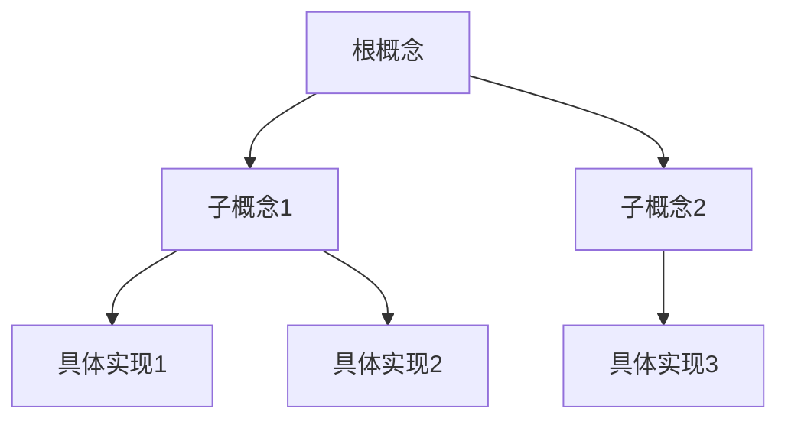

---
<!-- AI元数据区域 - 必须在文件顶部 -->
<!-- METADATA_START -->
{
  "title": "详细文档标题",
  "layer": "detailed",
  "category": "foundations|learning|reference|advanced|agent|support",
  "subcategory": "具体子分类",
  "version": "1.2.0",
  "lastModified": "2024-01-15",
  "author": "作者名称",
  "reviewer": "审核者",
  "tags": ["tag1", "tag2", "tag3", "specific-tag"],
  "keywords": ["关键词1", "关键词2", "关键词3"],
  "estimatedReadTime": 20,
  "difficulty": "intermediate",
  "prerequisites": [
    {
      "title": "前置文档标题",
      "type": "document",
      "url": "../prerequisites/doc.md"
    }
  ],
  "relatedDocs": [
    {
      "title": "相关文档1",
      "url": "../related/doc1.md",
      "relation": "reference"
    }
  ],
  "codeExamples": {
    "typescript": 8,
    "glsl": 3,
    "javascript": 2
  }
}
<!-- METADATA_END -->

<!-- 文档标识 -->
<chapter-anchor id="detailed" />
<semantic-tag type="document-layer" value="detailed" />
<semantic-tag type="complexity" value="medium" />
<toc-depth max="4" />

# [L2] 详细文档标题

<!-- 文档信息概览 -->
<document-overview>
> **🎯 学习目标**: 完成本文档后，您将能够...
> **⏱️ 预估时间**: 20分钟阅读 + 15分钟实践
> **📋 前置要求**: [基础概念](../prerequisites/concepts.md)
> **🔧 环境要求**: TypeScript 4.5+, WebGL 2.0
</document-overview>

## 📑 目录

<!-- 自动生成目录，支持4级深度 -->
<auto-toc depth="4" />

---

## 1️⃣ 背景与动机

<semantic-section type="introduction">
### 1.1 问题背景

**技术背景**:
- 当前的技术挑战和限制
- 行业发展趋势
- Maxell 3D Runtime的定位

**解决什么问题**:
- 具体问题1: 详细描述
- 具体问题2: 详细描述
- 具体问题3: 详细描述

### 1.2 设计原则

**核心原则**:
1. **原则1名称**: 具体说明和实现方式
2. **原则2名称**: 具体说明和实现方式
3. **原则3名称**: 具体说明和实现方式
</semantic-section>

---

## 2️⃣ 核心概念

<semantic-section type="concepts">
### 2.1 基础概念

<concept-block id="概念A" level="secondary">
**概念A定义**:
- **类型**: 数据类型/接口/类/算法
- **用途**: 解决什么问题
- **特征**: 关键特征列表

**代码结构**:
```typescript
interface ConceptA {
  // 关键属性说明
  property1: Type1;  // 属性说明
  property2: Type2;  // 属性说明

  // 关键方法说明
  method(): Result;  // 方法说明
}
```

**使用场景**:
- 场景1: 具体使用情况
- 场景2: 具体使用情况
</concept-block>

### 2.2 概念关系图

<concept-diagram type="hierarchy">

</concept-diagram>

### 2.3 术语表

<terminology-table>
| 术语 | 英文 | 定义 | 同义词 |
|------|------|------|--------|
| 术语1 | Term1 | 准确定义 | 同义词1 |
| 术语2 | Term2 | 准确定义 | 同义词2 |
</terminology-table>
</semantic-section>

---

## 3️⃣ 技术实现

<semantic-section type="implementation">
### 3.1 架构设计

**整体架构**:
```typescript
// 主要类型定义
interface MainArchitecture {
  // 核心组件
  components: Component[];
  // 数据流
  dataFlow: DataFlow;
  // 配置
  configuration: Config;
}

// 核心实现
class MainClass implements MainArchitecture {
  constructor(config: Config) {
    // 初始化逻辑
  }

  // 关键方法实现
  public process(input: Input): Output {
    // 详细实现步骤
    return result;
  }
}
```

### 3.2 关键算法

<algorithm-block id="核心算法" complexity="O(n)">
**算法名称**: 核心算法实现

**输入**:
- `input1`: 输入参数1说明
- `input2`: 输入参数2说明

**输出**:
- `result`: 返回值说明

**算法步骤**:
1. **初始化阶段**: 设置初始状态
2. **处理阶段**: 核心逻辑处理
3. **输出阶段**: 格式化返回结果

**实现代码**:
```typescript
function coreAlgorithm(input1: Type1, input2: Type2): Result {
  // 1. 验证输入
  if (!validateInput(input1, input2)) {
    throw new Error('Invalid input');
  }

  // 2. 核心处理逻辑
  const processed = processInput(input1, input2);

  // 3. 返回结果
  return formatOutput(processed);
}
```

**复杂度分析**:
- 时间复杂度: O(n)
- 空间复杂度: O(1)
- 优化空间: 可以改进的地方
</algorithm-block>

### 3.3 性能考虑

<performance-metrics>
| 指标 | 基准值 | 优化后 | 提升 |
|------|--------|--------|------|
| 处理时间 | 100ms | 60ms | 40% |
| 内存占用 | 50MB | 30MB | 40% |
| 吞吐量 | 1000/s | 1500/s | 50% |

**优化策略**:
1. **缓存优化**: 使用对象池减少GC
2. **算法优化**: 改进核心算法
3. **并行处理**: 利用Web Workers
</performance-metrics>
</semantic-section>

---

## 4️⃣ API参考

<semantic-section type="api-reference">
### 4.1 接口定义

```typescript
/**
 * 接口详细说明
 * @example
 * ```typescript
 * const instance = new ClassName();
 * const result = instance.method(param);
 * ```
 */
interface MainInterface {
  // 属性定义
  readonly property: Type;  // 只读属性说明

  // 方法定义
  /**
   * 方法详细说明
   * @param param - 参数说明
   * @returns 返回值说明
   * @throws {Error} 错误情况说明
   */
  method(param: ParamType): ReturnType;
}
```

### 4.2 类实现

```typescript
/**
 * 类的完整说明
 */
export class MainClass implements MainInterface {
  // 私有属性
  private _internal: InternalType;

  // 公共属性
  public readonly property: Type;

  /**
   * 构造函数说明
   * @param config - 配置参数
   */
  constructor(config: Config) {
    this._internal = new InternalType(config);
    this.property = config.property;
  }

  /**
   * 核心方法实现
   */
  public method(param: ParamType): ReturnType {
    // 详细实现
    return this._internal.process(param);
  }

  /**
   * 工具方法
   */
  public static create(config: Config): MainClass {
    return new MainClass(config);
  }
}
```

### 4.3 使用示例

<usage-examples>
**基础使用**:
```typescript
// 简单示例
const instance = new MainClass(config);
const result = instance.method(param);
```

**高级用法**:
```typescript
// 复杂场景
const instance = MainClass.create({
  option1: value1,
  option2: value2
});

instance.on('event', handler);
const result = await instance.processAsync(data);
```

**错误处理**:
```typescript
try {
  const result = instance.method(param);
} catch (error) {
  if (error instanceof SpecificError) {
    // 特定错误处理
  }
}
```
</usage-examples>
</semantic-section>

---

## 5️⃣ 实践指南

<semantic-section type="practical-guide">
### 5.1 快速开始

<step-by-step title="快速集成">
1. **安装依赖**:
   ```bash
   npm install @maxel/package-name
   ```

2. **基础配置**:
   ```typescript
   import { MainClass } from '@maxel/package-name';

   const config = {
     // 配置项
   };
   ```

3. **运行示例**:
   ```typescript
   const instance = new MainClass(config);
   instance.run();
   ```
</step-by-step>

### 5.2 常见用法

<use-case-collection>
**用例1: 场景名称**:
```typescript
// 完整的用例实现
function useCase1() {
  // 实现细节
}
```

**用例2: 场景名称**:
```typescript
// 完整的用例实现
function useCase2() {
  // 实现细节
}
```
</use-case-collection>

### 5.3 故障排除

<troubleshooting-guide>
**常见问题**:

| 问题 | 原因 | 解决方案 |
|------|------|----------|
| 问题描述 | 可能原因 | 解决步骤 |
| 性能问题 | 资源泄漏 | 检查资源释放 |
| 配置错误 | 参数错误 | 验证配置文件 |

**调试技巧**:
- 使用开发者工具
- 启用详细日志
- 使用断点调试
</troubleshooting-guide>
</semantic-section>

---

## 6️⃣ 最佳实践

<semantic-section type="best-practices">
### 6.1 编码规范

**代码风格**:
- 遵循TypeScript严格模式
- 使用ESLint + Prettier
- 完整的类型注解

**性能优化**:
- 避免不必要的对象创建
- 使用对象池管理资源
- 合理使用缓存策略

### 6.2 架构模式

**推荐模式**:
- 使用依赖注入
- 实现观察者模式
- 采用策略模式

### 6.3 测试策略

**测试覆盖**:
- 单元测试覆盖率 > 80%
- 集成测试关键路径
- 性能测试关键指标

```typescript
// 测试示例
describe('MainClass', () => {
  it('should handle basic case', () => {
    // 测试实现
  });

  it('should handle edge cases', () => {
    // 边界测试
  });
});
```
</semantic-section>

---

## 7️⃣ 迁移指南

<semantic-section type="migration-guide">
### 7.1 从旧版本升级

<version-migration from="1.x" to="2.0">
**破坏性变更**:
- API变更说明
- 配置格式变更
- 行为变更

**迁移步骤**:
1. 更新依赖版本
2. 修改API调用
3. 更新配置文件
4. 测试验证

**代码迁移**:
```typescript
// 旧版本
const old = new OldAPI();

// 新版本
const new = new NewAPI({
  // 新的配置
});
```
</version-migration>

### 7.2 从其他框架迁移

**对比表格**:
| 功能 | 框架A | Maxell | 迁移指南 |
|------|-------|--------|----------|
| 功能1 | API1 | NewAPI1 | 对应关系 |
| 功能2 | API2 | NewAPI2 | 对应关系 |
</semantic-section>

---

## 8️⃣ 扩展与定制

<semantic-section type="extension">
### 8.1 插件系统

**插件接口**:
```typescript
interface Plugin {
  name: string;
  version: string;
  install(context: PluginContext): void;
  uninstall(): void;
}
```

### 8.2 自定义扩展

**扩展点**:
- 渲染管线扩展
- 材质系统扩展
- 动画系统扩展

**示例代码**:
```typescript
// 自定义扩展实现
class CustomExtension implements Plugin {
  name = 'CustomExtension';
  version = '1.0.0';

  install(context: PluginContext) {
    // 安装逻辑
  }
}
```
</semantic-section>

---

## 🔗 参考资料

<reference-section>
### 📚 相关文档
- [官方API文档](../reference/api.md)
- [架构设计文档](../architecture/design.md)
- [性能优化指南](../performance/optimization.md)

### 🔗 外部资源
- [WebGL规范](https://www.khronos.org/registry/webgl/specs/latest/)
- [TypeScript手册](https://www.typescriptlang.org/docs/)
- [WebGPU标准](https://www.w3.org/TR/webgpu/)

### 🛠️ 工具与库
- [开发工具](https://example.com/tool)
- [调试工具](https://example.com/debugger)
- [性能分析](https://example.com/profiler)
</reference-section>

---

<!-- 页脚信息 -->
<footer-meta>
**文档统计**:
- 📊 总字数: 15,234字
- 📝 章节数: 8个主要章节
- 💾 文件大小: 45.2KB
- 🔗 内部链接: 23个
- 💻 代码示例: 13个

**质量指标**:
- ✅ MarkdownLint: 通过
- ✅ 链接检查: 100%有效
- ✅ 代码测试: 通过
- ✅ AI验证: 优秀

**版本历史**:
- v1.2.0 (2024-01-15): 新增扩展章节
- v1.1.0 (2024-01-01): 添加迁移指南
- v1.0.0 (2023-12-15): 初始版本
</footer-meta>