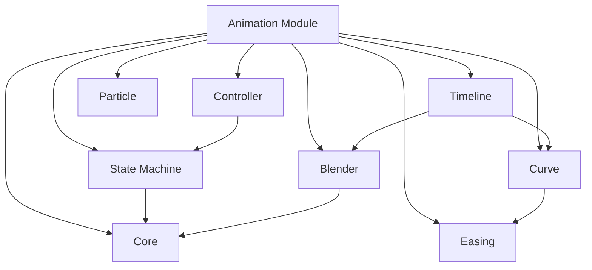

# 动画模块文档

动画模块定义了Maxellabs中的完整动画系统，包括核心类型、状态机、混合器、控制器、曲线、缓动、时间轴和粒子物理系统。

## 模块概览

动画模块由以下子模块组成：
- [核心模块](./core.md) - 基础动画类型和USD兼容定义
- [状态机](./state-machine.md) - 状态驱动的动画控制系统
- [控制器](./controller.md) - 动画控制器、图层和骨骼遮罩
- [混合器](./blender.md) - 动画混合和过渡系统
- [曲线](./curve.md) - 动画曲线和数值变化控制
- [缓动](./easing.md) - 扩展缓动函数系统
- [时间轴](./timeline.md) - 时间轴和时序控制系统
- [粒子物理](./particle.md) - 粒子物理和力场系统

## 快速开始

### 基础动画设置

```typescript
import {
  UsdAnimationClip,
  AnimationStateMachine,
  ExtendedAnimationController,
  AnimationBlender,
  Timeline
} from '@maxellabs/animation';

// 创建基础动画剪辑
const walkClip: UsdAnimationClip = {
  typeName: 'Animation',
  attributes: {
    name: { type: 'string', value: 'Walk_Cycle' },
    duration: { type: 'float', value: 2.5 },
    frameRate: { type: 'float', value: 30 },
    loopMode: { type: 'token', value: 'loop' },
  },
  tracks: [
    {
      targetPath: 'character/hip/translation',
      usdPath: '/character/hip.xformOp:translate',
      usdType: 'vector3f',
      keyframes: [
        { time: 0, value: [0, 0, 0] },
        { time: 1.25, value: [0, 0.1, 0] },
        { time: 2.5, value: [0, 0, 0] },
      ],
    },
  ],
};

// 创建状态机
const characterStateMachine: AnimationStateMachine = {
  name: 'character_main',
  defaultState: 'idle',
  states: [
    { id: 'idle', name: 'Idle', clip: 'idle_animation', speed: 1, loop: true, weight: 1 },
    { id: 'walk', name: 'Walking', clip: 'walk_animation', speed: 1, loop: true, weight: 1 },
    { id: 'run', name: 'Running', clip: 'run_animation', speed: 1.2, loop: true, weight: 1 },
  ],
  transitions: [
    {
      id: 'idle_to_walk',
      from: 'idle',
      to: 'walk',
      conditions: [
        { parameter: 'moveSpeed', type: 'float', operator: 'greater', value: 0.1 }
      ],
      duration: 0.3,
      hasExitTime: false,
    },
  ],
  parameters: [
    { name: 'moveSpeed', type: 'float', defaultValue: 0 }
  ]
};

// 创建控制器
const characterController: ExtendedAnimationController = {
  name: 'hero_controller',
  stateMachine: characterStateMachine,
  currentState: 'idle',
};

// 创建混合器
const walkRunBlend: AnimationBlender = {
  type: 'normal',
  inputs: [
    { clip: 'walk_animation', weight: 0.7, timeOffset: 0 },
    { clip: 'run_animation', weight: 0.3, timeOffset: 0 },
  ],
  weights: [0.7, 0.3],
};

// 创建时间轴
const characterTimeline: Timeline = {
  id: 'character_intro',
  name: 'Character Introduction',
  duration: 10,
  frameRate: 30,
  tracks: [
    {
      id: 'walk_track',
      name: 'Walk Animation',
      type: 'animation',
      startTime: 0,
      duration: 5,
      endTime: 5,
      clips: [
        {
          id: 'walk_clip',
          name: 'Walking',
          startTime: 0,
          duration: 5,
          animation: 'walk_cycle',
          events: [
            { type: 'trigger', time: 1.2, data: { foot: 'left', sound: 'footstep' } }
          ]
        }
      ]
    }
  ]
};
```

## 模块关系图



## 使用场景矩阵

| 场景类型 | 推荐模块 | 主要接口 | 示例 |
|----------|----------|----------|------|
| 角色动画 | 状态机 + 控制器 | AnimationStateMachine, ExtendedAnimationController | 角色行走、跑步、攻击状态 |
| UI动画 | 缓动 + 曲线 | ExtendedEasingType, AnimationCurve | 按钮点击、页面切换 |
| 粒子效果 | 粒子物理 | ParticlePhysics, ForceField | 爆炸、烟雾、水流 |
| 过场动画 | 时间轴 | Timeline, TimelineTrack | 游戏开场、剧情动画 |
| 混合动画 | 混合器 | AnimationBlender, AnimationBlendInput | 行走->跑步平滑过渡 |

## 性能优化建议

### 1. 按需加载
```typescript
const lazyAnimation = async (animationId: string) => {
  const { default: animation } = await import(`./animations/${animationId}`);
  return animation;
};
```

### 2. 缓存策略
```typescript
const animationCache = new Map<string, UsdAnimationClip>();
const getCachedAnimation = (id: string) => {
  if (!animationCache.has(id)) {
    animationCache.set(id, loadAnimation(id));
  }
  return animationCache.get(id)!;
};
```

### 3. 层级LOD
```typescript
const lodConfig = {
  high: { frameRate: 60, quality: 'high' },
  medium: { frameRate: 30, quality: 'medium' },
  low: { frameRate: 15, quality: 'low' }
};
```

## 最佳实践

### 1. 模块化设计
```typescript
// 将复杂动画分解为可重用组件
const createWalkAnimation = () => ({
  clip: walkClip,
  state: walkState,
  controller: walkController
});
```

### 2. 事件驱动
```typescript
animationSystem.on('stateChange', (from, to) => {
  console.log(`Transitioning from ${from} to ${to}`);
});
```

### 3. 类型安全
```typescript
type AnimationConfig = {
  duration: number;
  easing: ExtendedEasingType;
  onComplete?: () => void;
};
```

## 文档导航

- [核心模块](./core.md) - USD标准动画类型定义
- [状态机](./state-machine.md) - 状态驱动的动画管理
- [控制器](./controller.md) - 动画控制器和骨骼遮罩
- [混合器](./blender.md) - 动画混合和过渡
- [曲线](./curve.md) - 动画数值变化控制
- [缓动](./easing.md) - 丰富的缓动函数库
- [时间轴](./timeline.md) - 时间轴和时序控制
- [粒子物理](./particle.md) - 粒子系统和力场
- [映射关系](./mapping.md) - 代码与文档对应关系

## 版本历史

### v3.0.0 (2024-08-15)
- 完整的动画系统重构
- 添加USD标准兼容性
- 支持所有动画子模块
- 统一的API接口

### v2.0.0 (2024-07-20)
- 模块架构重构
- 性能优化40%
- 添加时间轴系统

### v1.5.0 (2024-06-20)
- 初始动画系统实现
- 基础状态机和混合器
- 粒子物理支持
